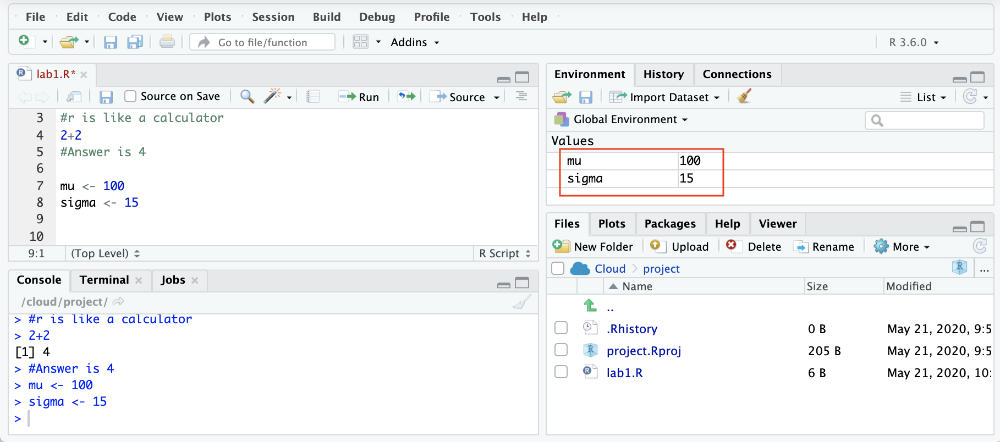
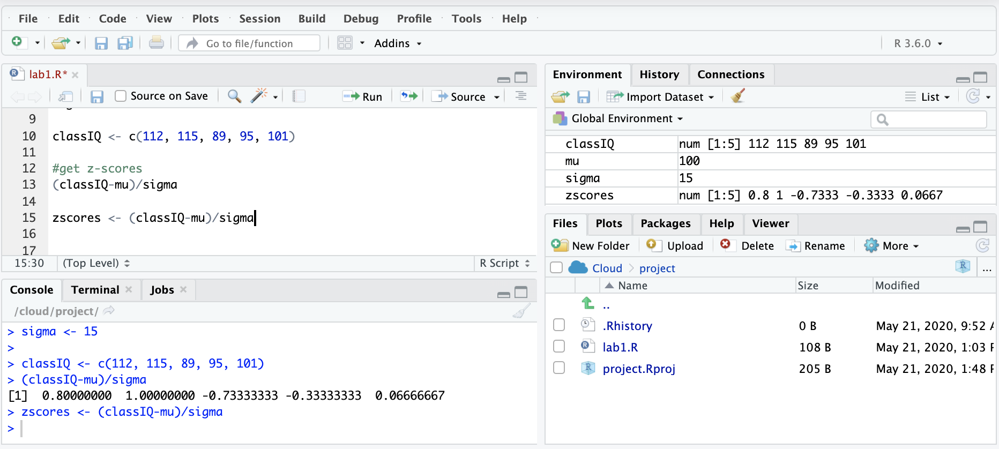
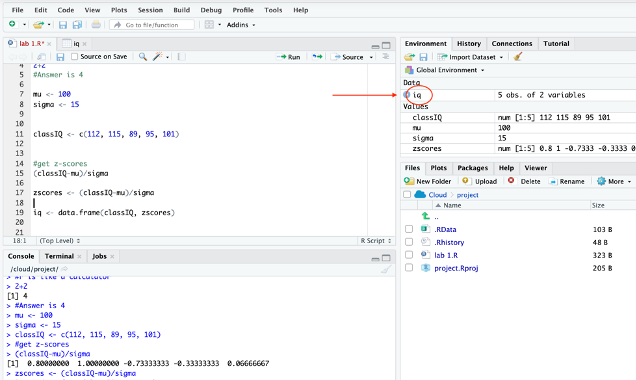
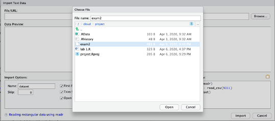

# Introduction

This chapter introduces the Rstudio cloud environment and describes how to import data into the RStudio cloud. 

R cannot handle typos and is case sensitive (‘Gender’ is not the same as ‘gender’). If your code will not run check for typos and caps. Related to this point, do not be afraid to copy and paste with using R. I often copy and paste code and replace variable or dataset names as needed. (This is one of the few times in education where copy and paste is OK!)

## Layout of Rstudio cloud

Rstudio has four panes: the console panel, the script panel, the environment and history panel, and the files and plots panel. Each will be describe in turn next.

### Console 
The console panel of R studio is where you can type commands and where you will see the output of commands. 

In its most basic form, you can think of R as a fancy calculator. 

For example:

In the console type `2+2` and then press RETURN on your keyboard. The answer '4' will apear on the next line. 

The `>` in the last line of the console means that the console is ready for a command (see red circle in the picture above). 

If `>` is missing from the last line, it means that R is waiting for you to complete a command. 

For example, type `1+` in the console and then hit enter. 

The plus sign means the command is incomplete. 

Push the **ESC** button on your keyboard to get back to the command prompt.

### Script

One of the benefits of using R is that you can save a record of your work using scripts. Records of your work allow you to easily start and stop an assignment or research project. You can pick up where you left off whether it is 20 minutes later or 2 years later. It also lets you share with others – from professors, to collaborators, to peer reviewers. 

To create a new script, go to the top bar menu:

**FILE -> NEW FILE -> R SCRIPT**

A new script will open in the top left of the RStudio platform.

**You should run code from scripts**

Scripts are similar to running command in the console (this is what you did in the last section). 

For example, type `5+5` in the script panel. 

In order to run command in a script you should click the run button while the cursor is in the code or the code is selected. You can also run the code by pressing the COMMAND and RETURN keys on your keyboard at the same time (the ALT and RETURN key on a pc). 

After the code is run, the results will automatically appear the in console (see red arrow in the picture below).

 

In order to use the script again you must **save** it. 

From the drop-down menu select:

**FILE -> SAVE AS**

 

Type **lab 1** into the file name box. And then click the SAVE button. 

 

Your file should now be listed in the files window in the bottom right.

 

**This script file is a record of your work and is how you will be graded for this lab. Make sure you saved this file and complete the rest of this lab in your ‘lab1’ script.** 

Within a script you should include comments to yourself and others using `#`. Anything with a `#` in front of it will not run. These comments and explanations are an important part of an R script. 

For example, type the following in to the script and then run it. 

`#r is like a calculator`

`2+2`

`#Answer is 4`

Note that the comments are green in the script.

### Environment and history 
In the top right corner of RStudio is the environment and history window. The **history tab** shows every line of code that has been run in the current session. 

The **environment tab** is where all active **objects** are listed. An object is something can hold information for later use. The information can be data, values, output, or functions. 

Objects are assigned using `<-`. Values on the right side of  `<-` will be assigned to the object on the left side.

For example, let’s tell R that the population mean of IQ scores is 100 and the population standard deviation is 15. 

To do this use the following code:

`mu <- 100`

`sigma <- 15`

After you run these commands, the objects will now be listed in the environment panel in the top left. 

The shortcut for making `<-` is the ALT and – key together. (or OPTION and – on a mac)

#### Vectors

It is possible to store more than one number in an object. One way to do this is to use a a **vector**. Assign a set of numbers a vector with the **combine** function: `c()`. Do use this, type all the numbers you want to store within the parentheses in a comma separated list. 

For example, let’s enter IQ scores of students in a small class. 

To do this use the following code:

`classIQ <- c(112, 115, 89, 95, 101)`

After you run this code,the classIQ vector should appear in the environment. 

Here is a picture of what your screen should look like:

Calculations with vectors apply to all data points. 

For example, let’s calculate the z-scores for each of the IQ scores.

To do this use the following code:

`#get z-scores`

`(classIQ-mu)/sigma`

The results will appear in the console (See the red box in the picture below)

It is possible to save these answers as a vector using the `<-` function.

For example, let's save those zscores in a vector called zscores. 

To do this use the following code:

`zscores <- (classIQ-mu)/sigma`

There should now be a vector in the environmnet called zscores.

Here is a picture so that you can check your progress:

#### Data frames

Right now the IQ scores and the z-scores are in separate objects. Variables often need to be in a single object in order to do some basic analyses. You can combine the classIQ and the zscores variable using the **data.frame** command. 

To do this use the following code:

`iq <- data.frame(classIQ, zscores)`  

* This command takes the form of DatasetName <- data.frame(Variable1, Variable2, etc)  
* The dataset name can be anything you want that you have not already used  
  + the name must be one word (there cannot be spaces in the name)  
  

This object will be listed under data instead of values in the environment panel.

Double-click on the word ‘iq’ in the environment panel to look at the dataset that you just created (it is circled in red in the picture above). 

A new tab will open with a spreadsheet view of the dataset. When you are done viewing the data, you can close it by click on the 'x' next to the name iq.

Note that after looking at the dataset this way, the command `view(iq)` appeared in the console. You can look at the dataset with the **view** command as well 

Finally, when typing the code to create the data frame, you may have noticed that RStudio uses **predictive text**. This means that RStudio will suggest functions and objects as you type. You should take advantage of this nice feature!

## Importing data into Rstudio cloud

In the Introduction section you learned how to assign data to a **vector** using the **combine** function.

Another way to assign data to an object is by first entering the data into a spreadsheet (like google sheets or excel) and then import the data into RStudio. This will be our preferred method. 

First download the exam2.csv file from d2l.

### Upload the data into Rstudio Cloud

Then select the UPLOAD button in the files window. 

In the Upload Files window, click the CHOOSE FILE button and then navigate to the exam2.csv file on your computer. Then click the OK button. 

The data file should now be listed in the files section of RStudio. 

### Import data 

Then you need to import the data into the environment (i.e. assign the data to an object). This can be done through using point and click options or with code. 

#### Point and click
First click on the **IMPORT DATASET** button in the environment panel. 

Then select the **‘FROM TEXT (READR)’**

The first time you select this – the following window will appear asking if you would like to install the readr package. Select YES. I will introduce packages in the next section.  

After you select yes, R will begin downloading the package. This can take a few minutes and will look something like this:

It is important to be *patient* here and let the package download completely before you move on to the next step.  

When the download is complete, your screen should look like this:

Note that you can see that the package was successfully installed in the console in the bottom left. The next time you use readr to import data – you will not have to download the package first. 

Next select the BROWSE button in the top left corner of the import data window. 

In the choose file window, select ‘exam2’. And then select OPEN.

The next window should look like this:

From here you should click the IMPORT button.  

But first note the **Code Preview** box. This is the code you could use to import data (instead of clicking through all these windows). Copy this code before I click the import button and then paste it into your script for your records and in case you need to assign the file to an object again (because it is faster with code).

#### Code

Alternatively you could have typed the code that you copy and pasted (and not gone through all of the point and click windows).   

`Library(readr)`   
`exam2 <- read_cvs("exam2.csv")`    

* This command takes the form of DatasetName <- read_cvs("FILENAME.csv")   
* The dataset name can be anything that you have not already used   
    + the name must be one word (there cannot be spaces in the name)  
* If you have not installed the readr package, you will have to so first (see the packages chapter for more information)

#### View data

Double click on the word exam2 in the environment panel to look at the dataset.  

Each column is a different variable. Each row is a different participant (in this example a student).  
-	The first column is an arbitrary student ID number – so that the students’ identity is protected.  
-	The second column is exam points earned by the students out of 20 (this is real data from a Fall 2019 class).  
-	The third column is the number of hours the students studied for the exam (this is made up data).  
-	The fourth column is whether or not students ate cheese the night before the exam (1 = no; 2 = yes… also made up data).  
-	The last column is data on whether or not students drank wine the night before the exam (1 = no; 2 = yes… also made up data). 

