--- 
title: "Tools for Working with Data"
author: "Nicole Sorhagen, Ph.D."
date: "`r Sys.Date()`"
description: This GitBook describes tools students can use to work with data.
documentclass: book
link-citations: yes
bibliography:
- book.bib
- packages.bib
site: bookdown::bookdown_site
biblio-style: apalike
---

# About this book

This book describes how to use R as a tool to work with data.  

R statistics is becoming increasingly popular for data management and analysis due to its accessibility and versatility. For example, R can produce records of data analyses, which is consistent with the growing move towards reproducible and open science within the field of psychology. R statistics is also known for making elegant graphs, which can help develop data visualization skills. Because it is open-sourced it is extremely flexible - people create and share packages that make certain aspects of data analysis easy.  

R is a programming language. Although learning a programming language can seem a bit intimidating, there are many benefits to trying to figure it out. Mastering the basics of R could be useful for your future coursework, as well as for data management and analysis needs outside the classroom (independent research, future employment, etc.). That is to say, Learning the basics of a programming language is a highly transferable skill.  

The R programming language can be used within the R software as well as other programs. RStudio is a IDE (integrated development environment) and was designed to make the use of the R programming language more user friendly.  

R, and its companion program RStudio, are free and available in PC, Mac, and Linux versions, so students can have it on their own computer - eliminating the need to visit computer labs or to buy student versions of expensive software. R can be downloaded from the CRAN (Comprehensive R Archive Network) (https://www.r-project.org/). Rstudio can be found here: https://rstudio.com/.  

While you are welcome to download R and Rstudio on your personal computer, you do not have to for this course. We will be using Rstudio on a website called Rstudio cloud for class work (this is discussed in more detail in the next chapter). So I am not going to go into detail on downloading the programs on to your computer here. Please email me if you are interested in this and are having a hard time figuring it out.  

Finally, please note that I will be updating this book over the course of the semester.  


<a rel="license" href="http://creativecommons.org/licenses/by-nd/4.0/"></a><br />This work is licensed under a <a rel="license" href="http://creativecommons.org/licenses/by-nd/4.0/">Creative Commons Attribution-NoDerivatives 4.0 International License</a>.


<!--chapter:end:index.Rmd-->

# Set up project on Rstudio Cloud 

We will use Rstudio cloud on this website: https://rstudio.cloud. 

You must first make an Rstudio account by clicking the sign up button in the top right corner. (this is free)  


Then join our shared RStudio cloud workspace with the link that I sent you in the email titled 'Rstudio cloud shared workspace'.   

**You MUST join our shared workspace.** I will be checking your work through this shared RStudio cloud workspace. Within this shared workspace, I will be able to see everyone’s project, but you will only be able to see your project and my project.  

Once you are in your Rstudio Cloud account...   

Expand the R studio cloud options by clicking on the 3 lines in the top left corner. 


Then select our course (which will be titled the name of course and the semester). If you cannot see this option – then you have not been added to our shared workspace.  

Once you are in the shared the classes workspace, open a new project. 

Call this project your last name by clicking on the box that says ‘Untitled Project’ and typing your last name.   

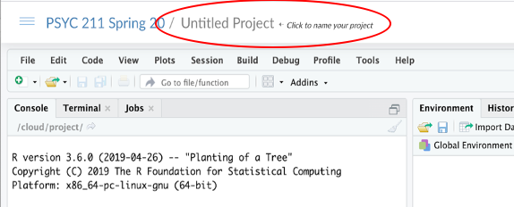


<!--chapter:end:setuprstudiocloud.Rmd-->

# Introduction

This chapter introduces the Rstudio cloud environment and describes how to import data into the RStudio cloud. 

R cannot handle typos and is case sensitive (‘Gender’ is not the same as ‘gender’). If your code will not run check for typos and caps. Related to this point, do not be afraid to copy and paste with using R. I often copy and paste code and replace variable or dataset names as needed. (This is one of the few times in education where copy and paste is OK!)

## Layout of Rstudio cloud

Rstudio has four panes: the console panel, the script panel, the environment and history panel, and the files and plots panel. Each will be describe in turn next.

### Console 
The console panel of R studio is where you can type commands and where you will see the output of commands. 

In its most basic form, you can think of R as a fancy calculator. 

For example:

In the console type `2+2` and then press RETURN on your keyboard. The answer '4' will apear on the next line. 

The `>` in the last line of the console means that the console is ready for a command (see red circle in the picture above). 


If `>` is missing from the last line, it means that R is waiting for you to complete a command. 

For example, type `1+` in the console and then hit enter. 

The plus sign means the command is incomplete. 


Push the **ESC** button on your keyboard to get back to the command prompt.


### Script

One of the benefits of using R is that you can save a record of your work using scripts. Records of your work allow you to easily start and stop an assignment or research project. You can pick up where you left off whether it is 20 minutes later or 2 years later. It also lets you share with others – from professors, to collaborators, to peer reviewers. 

To create a new script, go to the top bar menu:

**FILE -> NEW FILE -> R SCRIPT**

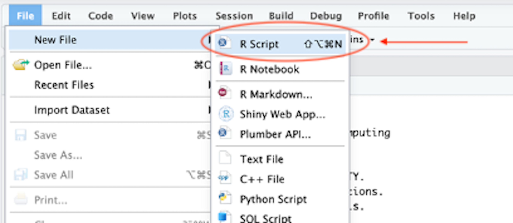

A new script will open in the top left of the RStudio platform.

**You should run code from scripts**

Scripts are similar to running command in the console (this is what you did in the last section). 

For example, type `5+5` in the script panel. 

In order to run command in a script you should click the run button while the cursor is in the code or the code is selected. You can also run the code by pressing the COMMAND and RETURN keys on your keyboard at the same time (the ALT and RETURN key on a pc). 

After the code is run, the results will automatically appear the in console (see red arrow in the picture below).

 

In order to use the script again you must **save** it. 

From the drop-down menu select:

**FILE -> SAVE AS**

 

Type **lab 1** into the file name box. And then click the SAVE button. 

 

Your file should now be listed in the files window in the bottom right.

 

**This script file is a record of your work and is how you will be graded for this lab. Make sure you saved this file and complete the rest of this lab in your ‘lab1’ script.** 

Within a script you should include comments to yourself and others using `#`. Anything with a `#` in front of it will not run. These comments and explanations are an important part of an R script. 

For example, type the following in to the script and then run it. 

`#r is like a calculator`

`2+2`

`#Answer is 4`


Note that the comments are green in the script.

### Environment and history 
In the top right corner of RStudio is the environment and history window. The **history tab** shows every line of code that has been run in the current session. 

The **environment tab** is where all active **objects** are listed. An object is something can hold information for later use. The information can be data, values, output, or functions. 

Objects are assigned using `<-`. Values on the right side of  `<-` will be assigned to the object on the left side.

For example, let’s tell R that the population mean of IQ scores is 100 and the population standard deviation is 15. 

To do this use the following code:

`mu <- 100`

`sigma <- 15`

After you run these commands, the objects will now be listed in the environment panel in the top left. 


The shortcut for making `<-` is the ALT and – key together. (or OPTION and – on a mac)

#### Vectors

It is possible to store more than one number in an object. One way to do this is to use a a **vector**. Assign a set of numbers a vector with the **combine** function: `c()`. Do use this, type all the numbers you want to store within the parentheses in a comma separated list. 

For example, let’s enter IQ scores of students in a small class. 

To do this use the following code:

`classIQ <- c(112, 115, 89, 95, 101)`

After you run this code,the classIQ vector should appear in the environment. 

Here is a picture of what your screen should look like:


Calculations with vectors apply to all data points. 

For example, let’s calculate the z-scores for each of the IQ scores.

To do this use the following code:

`#get z-scores`

`(classIQ-mu)/sigma`

The results will appear in the console (See the red box in the picture below)

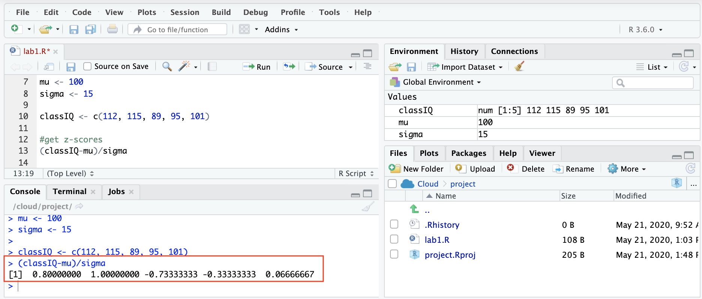

It is possible to save these answers as a vector using the `<-` function.

For example, let's save those zscores in a vector called zscores. 

To do this use the following code:

`zscores <- (classIQ-mu)/sigma`

There should now be a vector in the environmnet called zscores.

Here is a picture so that you can check your progress:


#### Data frames

Right now the IQ scores and the z-scores are in separate objects. Variables often need to be in a single object in order to do some basic analyses. You can combine the classIQ and the zscores variable using the **data.frame** command. 

To do this use the following code:

`iq <- data.frame(classIQ, zscores)`  

* This command takes the form of DatasetName <- data.frame(Variable1, Variable2, etc)  
* The dataset name can be anything you want that you have not already used  
  + the name must be one word (there cannot be spaces in the name)  
  


This object will be listed under data instead of values in the environment panel.


Double-click on the word ‘iq’ in the environment panel to look at the dataset that you just created (it is circled in red in the picture above). 

A new tab will open with a spreadsheet view of the dataset. When you are done viewing the data, you can close it by click on the 'x' next to the name iq.

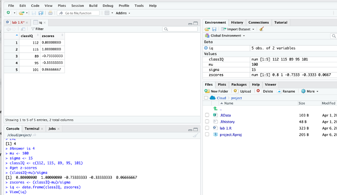

Note that after looking at the dataset this way, the command `view(iq)` appeared in the console. You can look at the dataset with the **view** command as well 

Finally, when typing the code to create the data frame, you may have noticed that RStudio uses **predictive text**. This means that RStudio will suggest functions and objects as you type. You should take advantage of this nice feature!


## Importing data into Rstudio cloud

In the Introduction section you learned how to assign data to a **vector** using the **combine** function.

Another way to assign data to an object is by first entering the data into a spreadsheet (like google sheets or excel) and then import the data into RStudio. This will be our preferred method. 

First download the exam2.csv file from d2l.

### Upload the data into Rstudio Cloud

Then select the UPLOAD button in the files window. 

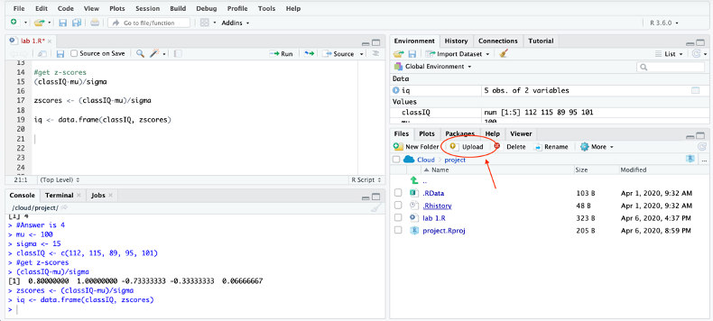

In the Upload Files window, click the CHOOSE FILE button and then navigate to the exam2.csv file on your computer. Then click the OK button. 

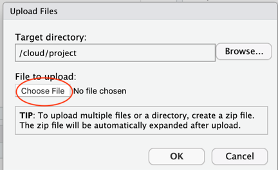

The data file should now be listed in the files section of RStudio. 


### Import data 

Then you need to import the data into the environment (i.e. assign the data to an object). This can be done through using point and click options or with code. 

#### Point and click
First click on the **IMPORT DATASET** button in the environment panel. 


Then select the **‘FROM TEXT (READR)’**

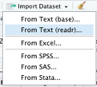


The first time you select this – the following window will appear asking if you would like to install the readr package. Select YES. I will introduce packages in the next section.  


After you select yes, R will begin downloading the package. This can take a few minutes and will look something like this:


It is important to be *patient* here and let the package download completely before you move on to the next step.  

When the download is complete, your screen should look like this:


Note that you can see that the package was successfully installed in the console in the bottom left. The next time you use readr to import data – you will not have to download the package first. 

Next select the BROWSE button in the top left corner of the import data window. 


In the choose file window, select ‘exam2’. And then select OPEN.

The next window should look like this:


From here you should click the IMPORT button.  

But first note the **Code Preview** box. This is the code you could use to import data (instead of clicking through all these windows). Copy this code before I click the import button and then paste it into your script for your records and in case you need to assign the file to an object again (because it is faster with code).


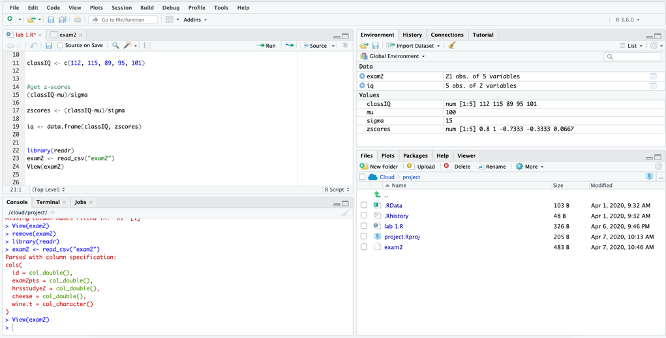

#### Code

Alternatively you could have typed the code that you copy and pasted (and not gone through all of the point and click windows).   

`Library(readr)`   
`exam2 <- read_cvs("exam2.csv")`    

* This command takes the form of DatasetName <- read_cvs("FILENAME.csv")   
* The dataset name can be anything that you have not already used   
    + the name must be one word (there cannot be spaces in the name)  
* If you have not installed the readr package, you will have to so first (see the packages chapter for more information)

#### View data

Double click on the word exam2 in the environment panel to look at the dataset.  


Each column is a different variable. Each row is a different participant (in this example a student).  
-	The first column is an arbitrary student ID number – so that the students’ identity is protected.  
-	The second column is exam points earned by the students out of 20 (this is real data from a Fall 2019 class).  
-	The third column is the number of hours the students studied for the exam (this is made up data).  
-	The fourth column is whether or not students ate cheese the night before the exam (1 = no; 2 = yes… also made up data).  
-	The last column is data on whether or not students drank wine the night before the exam (1 = no; 2 = yes… also made up data). 


<!--chapter:end:Introduction.Rmd-->

# Packages

**NOTE:** Please open a new script and call it lab 2 (or week 2) for the replication of this chapter and the picturing data chapter assignment.  

**Base R** refers to the functions that automatically come with R. But many people build on top of Base R to make R better. The way they do this is through **packages**, which contain new R functions. There are thousands of packages available that can do fancy things like quickly compute descriptive statistics and create APA style tables (and much much more).   

The first time you use a package, you need to install it. Once a package is installed, you will need to tell R that you want to use it by loading it. You will need to load any packages you want to use each time you open the R program. (I am not exactly sure how this works in the RStudio cloud because it does not seem to shut down when you close out of the RStudio cloud website. See the Restarting R section below for a work around.)   

That is, you only have to install a package once. You will have to load a package every time you want to use it.   


## Installing packages

The first time you use a package, you need to install it. We actually did this once already while importing data! This time let's learn more about the process.  

In RStudio, packages can be installed through point and click (GUI) or with code.  

### Installing packages using point and click (GUI)

Let’s first install a package called **Tidyverse**. Tidyverse was created by Hadley Wickham and his team with the aim of making various aspects of data analysis in R easier. It is actually collection of packages that include a lot of functions (e.g., subsetting, transforming, visualizing) that many people think of as essential for data analysis. (See the tidyverse website for additional information: https://www.tidyverse.org).    

To install a package with GUI go to the top bar menu:  

TOOLS -> INSTALL PACKAGES  


In the install packages window, type the name of the package you would like to install. For example, type `tidyverse` in the packages box.   

Then click INSTALL.  


Again, installing a package can be a little slow on the RStudio cloud. Please be patient (maybe this is a good time to stretch your legs, refill your beverage, let the dog out, etc.)

Your screen should look like this when it is starting to install:   


It should look like this when it is in the process of installing:  


And then this when the installation is complete:   

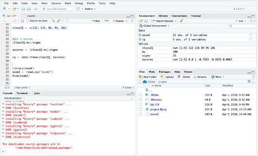

Do not proceed until the console says the package has been installed.  

### Installing packages using code   

You can also install a package using this code:  
`install.packages()`  

To install tidyverse, for example, you would use this code:  
`install.packages("tidyverse")`  
-	Note that the word tidyverse is in quotes   

But do not run this code – as you have already installed it with GUI.   

Instead, let's install a package called psych using the `install.packages` command. The **psych package** is a package for personality, psychometric, and psychological research. It has been developed at Northwestern University (maintained by William Revelle) to include useful functions for personality and psychological research.   

To install this package, use following command:   
`install.packages("psych")`

Your screen should look like this when the package is completely installed:  


Remember that installing packages is the first step to using them and they only have to be installed once.  

Next let’s learn how to load packages, so that you can use thier functions.   


## Loading Packages   

Installing a package is only the first step.  

**In order to use a package, it must be loaded first.**   

Packages can only be loaded with code. Packages need to be loaded every time you open the RStudio program. Most people's R scripts begin with the code that load packages.  

When you have the Rstudio program installed on your computer this is straight forward (either the program is open or closed). This is less clear with Rstudio cloud because it does not seem to always shut down when you close the web browser site. (Please see the section on restarting Rstudio in the misc section below for a work around.)    


The command to load a package is:   
`library()`    

For example, load the tidyverse package with this:  
`library(tidyverse)`   

After you run this code, your screen should look like this:  


The console shows that the Tidyverse package has been loaded (don’t worry about the conflicts for now).   

Next let's load the psych package using this command:  
`library(psych)`


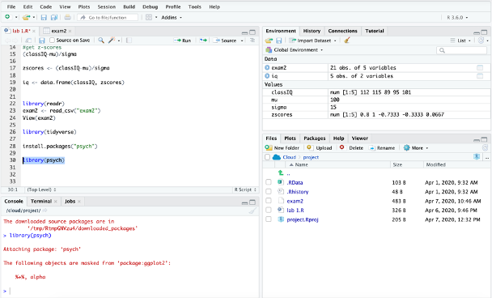
Again, don’t worry about the warning about masked functions for now.   

## Misc 

You can get additional information using the `help()` function and `?` help operator in R. They both provide access to documentation pages for all functions and packages.   

For example, use the following code to get more information about Tidyverse:  
`?tidyverse`

Or this command to get more information about Psych:  

`help(psych)`


### Restarting R

Because it is unclear whether Rstudio completely turns off when you close the website, you could restart the R session to simulate the act of closing and reopening the Rstudio program (like you could if it were installed on your computer).   

To do this, in the drop down menu go to:  

SESSION -> RESTART R  


When you restart the R session, everything in the script, environment, console, and files will remain.  

All packages that were loaded will be cleared, so you will have to reload them if you want to use them.  

If something is not working like it is suppose to (and you have checked for type-os), try restarting the R session. It could be that the functions of one package conflict or mask the functions of another package. 


<!--chapter:end:packages.Rmd-->

# Picturing Data

“The simple graph has brought more information to the data analyst’s mind than any other device.” — John Tukey  

This chapter focuses on how to make graphs and figures in R.  Data visualization is useful for descriptive statistics, data analysis, and communicating results.  


## Histograms

Here you will learn how to make a histogram. Histograms plot the frequency of each score in a set of data. Thus, they are essentially a graphic of a frequency distribution. They are useful for checking the shape of a distribution (many statistical tests assume data is approximately normally distributed), checking for coding errors, and checking for outliers.   

### Histograms with base R

Let’s first make histogram with base R by using the hist() function.   

A **function** in R is any kind of operation. For example, the `hist()` function will create a histogram. An **argument** is what a function acts on.   

For example, `hist(classIQ)` will return the histogram of the IQ scores in the classIQ vector. This code applies the function hist to the variable classIQ.   

After you run this command, your screen should look similar to this:   

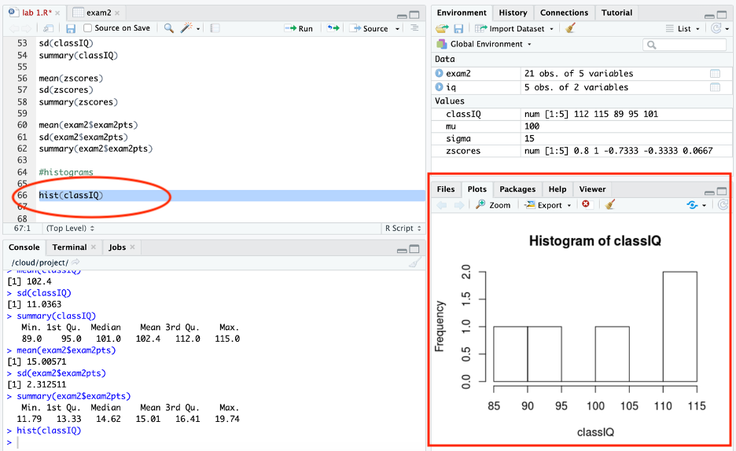
I circled and boxed what should match here. (Please excuse a few differences between this screenshot and your screen, like the name of the script, the code in the script before the histogram, and the results in the console. I had presented the material in a different order the last time I taught it.)    

In order to use a base R function with a variable within a data frame you have to tell R to first look in the data frame in order to find the variable. You do this with the dollar sign (`$`). Place the `$` between the name of the data frame and the name of the variable.   

For example, to use the `hist()` function to create a histogram of the exam 2 points variable in the exam 2 dataset, use this code:   

`hist(exam2$exam2pts)`  
- exam2$exam2pts is telling R to first go to the exam2 dataset and then use the exam2pts variable  

Here is a picture:   
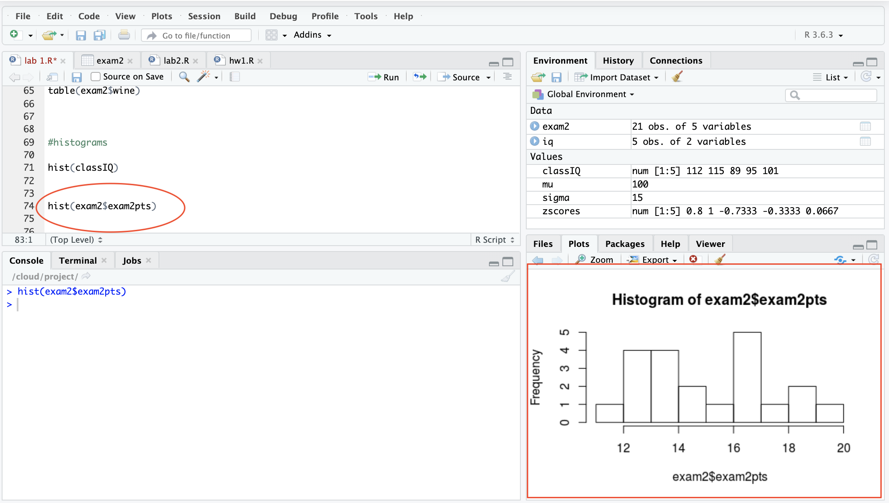

The data looks some what normally distributed, with a slight positive shew.  


### Histograms with tidyverse

The base R option is quick and easy. But it is not customizable. Because of this – many people prefer to use **ggplot** (of the Tidyverse package - so tidyverse needs to be loaded).    

Ggplot is typically taught with the analogy of a globe that is built one layer at a time. You start with a world of only ocean (no land). Then you progressively add “layers” of land, colors, terrain, legends, etc. This system is based on the grammar of graphics: statistical graphics map **data** onto perceivable **aesthetic attributes** (e.g., position, color, shape, size, line type) of **geometric objects** (e.g., points, bars, lines). Code can also be added to ggplots to make graphs in APA style.    

With ggplot, you build plots step-by-step, layer-by-layer using the following steps:    
1. Start with `ggplot()`   
2. Supply a dataset and aesthetic mapping, `aes()`   
3. Add on ...   
  + **Layers**, like `geom_point()` or `geom_histogram()`   
  + **Scales**, like `scale_colour_brewer()`   
  + **Faceting Specifications**, like `facet_wrap()`   
  + **Coordinate Systems**, like `coord_flip()`   


The code for a histogram of the exam 2 points is:  
`ggplot(exam2, aes(x=exam2pts)) +`   
    `geom_histogram(binwidth=1)`   

-	The first line starts with ggplot and then supplies a dataset and aesthetic mapping, `aes()`   
    - Because you supply the dataset this way - you do not need to use `$` to tell R where the variable is  
-	The second line adds the layer of a histogram   

After you run this code your screen should look like this:    


Note that the histogram here is more detailed than the one you produced with base R. This is because base R used 5-points bins, while ggplot used 1-point bins (because you told R to). Here it is easier to see that the data is slightly skewed right.   

In ggplot, it is easy to change the amount of points per bin by changing the number after the binwidth. For example, here I change the number to 3:    

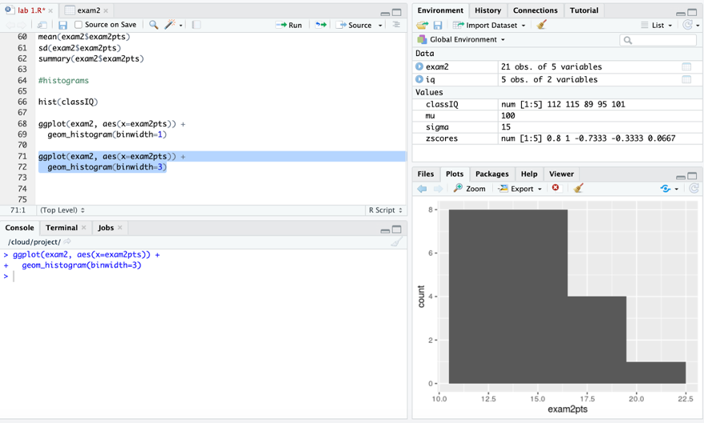
Some say that 10 bins in a histogram is a good rule of thumb (There are more precise equations for determining the “right” number of bins as well).   

Let’s look at a histogram of the number of hours studied for exam 2 next.   

Here is the code:    

`ggplot(exam2, aes(x=hrsstudye2)) +`    
  `geom_histogram(binwidth=1)`    


After you run this code, your screen should look like this:   


The histogram show that data approximates the normal distribution and is roughly mound shape.  

You do not need to run this – but I just want to show you that if I run only the first line of the histogram code, the figure would look like this:  

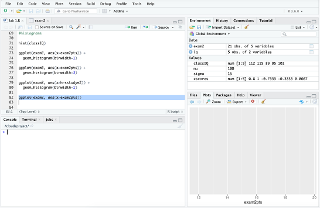

...so this is the world as only ocean – without land. The second line of the ggplot code (i.e. `geom_histogram(binwidth=1`)) adds the “land”.  


*Please note that I am going to start providing less screen shots of the whole Rstudio window from this point forward. When I include R code know that I mean that the code should be typed into a script.*   

## Scatterplots

```{r, include = FALSE}

library(tidyverse)
library(psych)
library(readr)

exam2 <- read_csv("exam2.csv")


```

A **Scatterplot** is a graph where one variable is plotted on the y-axis and the other is plotted on the x-axis. Each dot represents one participant, measured on two variables.  

We are going to focus on using ggplots to create scatterplots because it is the more powerful data visualization tool in R.  

### Two continuous variables 

Using the exam 2 dataset, let’s say we hypothesized that there is a positive association between exam 2 scores and the number of hours studied for the exam. One of the first steps of exploring this association is to create a scatterplot.  

Here is the code and resulting graph:   

```{r}
ggplot(exam2, aes(x=exam2pts, y=hrsstudye2)) +
  geom_point()

```  
  
The data points are trending upward, suggesting a positive relation between exam 2 scores and the number of hours. The students who studied longer for the exam received higher grades; While those students who studied for less time received lower grades.  


### One continuous and one categorical variable 

Let's say you were interested in the relation between cheese eating and exam 2 scores. You hypothesized that exam scores will be lowers for students who ate cheese the night before the exam because cheese gives nightmares. 

Traditionally psychology likes to visualize the relation between a continuous and categorical variable using a bar graph. However, bar graphs can be misleading about the true nature of the data. Because of this, I prefer to continue to use a scatterplot to look at the association between a continuous and categorical variable - with some alterations to show the mean and variability (which is important to show with group data).  

In ggplots you can alter the scatterplot to include the mean and variability, in addition to the actual data points, by including the `stat_summary()` function in the ggplot code.  The `stat_summary()` function adds statistics to a ggplot.  

To use the `stat_summary()` function you need to install the Hmisc package. It does not need to be loaded. *This is a rare exception on how packages in R normally work - The package does not need to be loaded in order for R to use it.*


Here is the code to install Hmisc:  

`install.packages("Hmisc")`   
- remember to be patient and wait until the package is completely installed.  


Then create the scatterplot with the following ggplot code:  

`ggplot(exam2, aes(x = cheese, y = exam2pts)) +`  
  `geom_point() +`  
  `stat_summary(fun.data = mean_cl_normal)`  

-	x is the categorical variable  
-	y is the continuous variable  
-	`geom_point()` includes the data points  
-	The `fun.data = mean_cl_normal` within the `stat_summary()` function adds the mean and the confidence interval around the mean.  

The graph should look like this:  


```{r echo = FALSE}

ggplot(exam2, aes(x = cheese, y = exam2pts)) +
  geom_point() +
  stat_summary(fun.data = mean_cl_normal)

```

The means are represented by the large dots. The lines represent the 95% confidence intervals, which shows the certainty around the mean and is based on the sample mean, standard deviation, and n.   

The small dots are the data points representing the participants cheese eating and exam grades.    

Here you can see that the mean exam 2 scores are pretty similar for students who did and did not eat cheese the night before the exam. The spread of the scores is also similar. (Remember from the introduction chapter 1 = no and 2 = yes).  

I like to make a few alterations to the previous code for aesthetics...   

`ggplot(exam2, aes(x = as.factor(cheese), y = exam2pts)) +`  
  `geom_point(color = "purple") +`  
  `stat_summary(fun.data = mean_cl_normal)`  

- The `color = "purple"` in the `geom_point()` function changes the color of the data points making the graph easier to read   
- The `as.factor(cheese)` tells R to treat the cheese variable as a factor, which makes the x-axis more visually appealing   


```{r echo = FALSE}

ggplot(exam2, aes(x = as.factor(cheese), y = exam2pts)) +
  geom_point(color = "purple") +
  stat_summary(fun.data = mean_cl_normal)


```
  

## Additional resources 


https://rstudio.cloud/learn/primers/1.1 


<!--chapter:end:plots.Rmd-->

# Descriptive Statistics

**NOTE:** Please open a new script and save it as lab 3 (or week 3) for the replication of this chapter and the measurement chapter assignment.  

```{r, include = FALSE}

library(readr)

exam2 <- read_csv("exam2.csv")


```

This section focuses on functions that find descriptive statistics. **Descriptive statistics** refer to measures of central tendency (mean, median, and mode) and measures of variability (standard deviation, variance, range, etc.).  

There are several functions that find descriptive statistics within R. My preferred method uses the Tidyverse and Psych packages, which I describe first. Next I will show you how to find descriptive statistics using base R.  

## Descriptive statistics using Tidyverse and Psych packages.
First load the tidyverse and psych packages (if they are not already loaded)

```{r message=FALSE, warning=FALSE}

library(tidyverse)
library(psych)

```

The `describe()` function of the Psych package was made to produce the most frequently requested stats in psychology research in an easy to read data frame. I pair this with tidyverse styled code (because of the piping - which I explain next). 

Here is the code to get descriptive statistics for the exam2 dataset we made:   

`exam2 %>%`   
  `describe()`   

-	The `describe()` function applies to all of the variables in the dataset (here exam2)
- The `%>%` in this code is called a **pipe**
-	Pipes are part of the Tidyverse package
-	The shortcut to write a pipe (`%>%`) is `shift + command + M (shift + alt + M on a pc)`
-	Pipes are a way to write strings of functions more easily
-	You can think of it as a "THEN"
-	So this code would be read as “use the exam2 dataset” THEN “compute descriptive statistics with the describe function”

The twitter handle WeAreRladies uses this example to show the sequential nature of a pipe ( %>% ):   
I woke up %>%  showered %>% dressed %>% glammed up %>% took breakfast %>% showed up to work    

Let's look at the results

```{r, echo = FALSE}
exam2 %>%
  describe()
```

The results show that the average exam points was 15.01 (out of 20), with a standard deviation of 2.31 points. Students studied for the exam for an average of 3.02 hours (SD = 2.20).  

As the cheese and wine variables are nominal, the mean and standard deviation are not particularly meaningful. Also, any statistics on the ID numbers are meaningless.  

This is a good place to mention that it is vital that you as a researcher understand what the numbers you are looking at are and the assumptions that they carry. R (or any computer program) will not tell you if what you asked for does not make sense or is not appropriate.  

Rather than getting meaningless results that you have to ignore, you could add the `select()` function to the command above to select certain variables within a dataset. Note that you must include more than one variable for the `select()` function. Use the `pull()` function if you want to select only one variable.  

For example, to select the exam2pts and hrsstudye2 variables use the following code:  

```{r}
exam2 %>%
  select(exam2pts, hrsstudye2) %>% 
  describe()
```

You should create frequency tables for nominal data. Do this with the `count()` function.  

For example, create a frequency table for the cheese variable with this code:  

```{r}
exam2 %>% 
  count(cheese)
```
- this code is saying to "use the exam 2 dataset and then count the cheese varible.  

The results show that 10 students did not eat cheese the night before Exam 2 (see Introduction for codebook – or what the 1 and 2 mean) and 11 students did eat cheese the night before the exam.   
   
Finally, often we want to know descriptive statistics by group. For example, say you were interested in relation between cheese eating and exam 2 scores. You would want to know the descriptive statistics of the exam 2 scores for the students who did and did not eat cheese.   

To do this I use the `describeBy()` function of the psych package, which reports basic summary statistics by a grouping variable. You have to tell R where to find the grouping variable by first including the dataset, followed by a `$` and the variable name. In this example: `exam2$cheese` (I can't figure out how to avoid the `$` here - I will give extra credit if you can.)    

Use the `pull()` function to select the exam2pts variable.   


```{r}
exam2 %>%
  pull(exam2pts) %>% 
  describeBy(exam2$cheese)
```

The results show that the average exam 2 score for students who ate cheese was 15.05 (SD = 2.34) and the average exam 2 score for students who did not ate cheese was 14.98 (SD = 2.4). Other statistics that you might find useful are the group's n, median, minimum and maximum scores, range, and standard error (se).   


## Descriptive statistics using base R

Descriptive statistics can also be computed using base R.  

When a variable is stored directly in an object, you can apply the mean and standard deviation functions to the object. 

For example: 
```{r, include = FALSE}
classIQ <- c(112, 115, 89, 95, 101)
```

```{r}
mean(classIQ)
sd(classIQ)
```


The summary function provides the range and median as well: 

```{r}
summary(classIQ)
```

Remember that if a variable is in a data frame, you have to tell R to first look in the data frame in order to find the variable. You do this with the dollar sign (`$`). Place the `$` between the name of the data frame and the name of the variable. 

For example, to find the average points earned on Exam 2 use the following code:

```{r}

mean(exam2$exam2pts)

```

Note that when typing this code RStudio will provide a list of the variables in the exam2 after you type the `$`. It is very convenient.   

The `table()` function of base R performs categorical tabulations of data, frequency tables, and cross tabulations.  

For the present example, the code is:  

```{r}

table(exam2$cheese)

```

Note that the table is laid out differently than the Tidyverse one above. But you can still easily see that 10 students did not eat cheese the night before Exam 2 and 11 students did eat cheese the night before the exam.    
  
*Some people think that the Tidyverse and Psych packages make computing descriptive statistics a bit easier/more direct/better/easier to understand than base R. You should decide which you prefer. (I tend to prefer Tidyverse and Psych). Another packages that compute descriptive statistics is skimr *


<!--chapter:end:Descriptives.Rmd-->

# Measurement
Math anxiety is the feeling of tension or worry in situations that involve math and is a major predictor of math achievement and career choices (Foley et al., 2017; Hembree, 1990).  
[Ramirez and colleagues (2013)](https://drive.google.com/file/d/1VvSqWL7W4mvA5MtDAF94GclVIemC_a9P/view?usp=sharing) developed the Child Math Anxiety Questionnaire (CMAQ) to measure math anxiety of young children. The measure (which can be seen below) consists of 8 questions which children responded to on a sliding scale that ranged from 1 to 16 points (the points were invisible to the children). Ramirez and colleagues (2013) calculated each child’s CMAQ score by computing an average score of the eight items. Low scores on the CMAQ indicates high levels of math anxiety.  


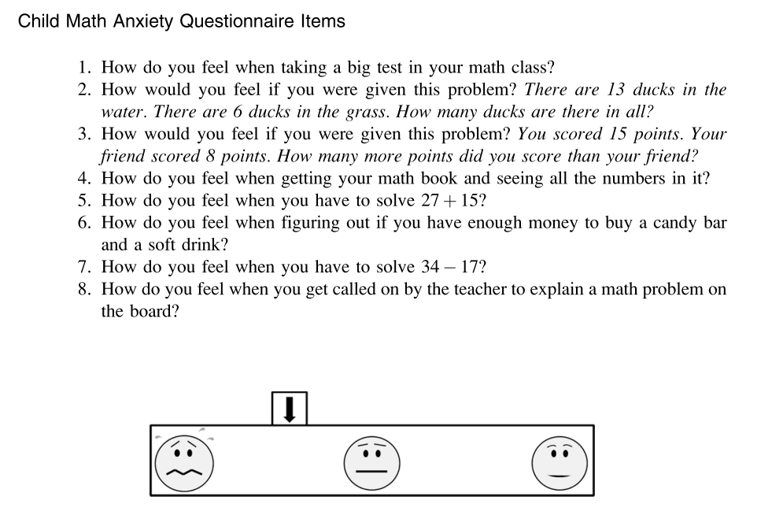

Let's pretend that you completed a pilot study testing the construct validity (if it is a good measure of math anxiety) of the CMAQ before Ramirez and her colleagues studied its relation to working memory and math achievement.  

You gave the CMAQ to a convenience sample of 40 second graders. In addition to measuring the students' math anxiety with the CMAQ, you also measured the students' math ability, general anxiety, and you gave them a different measure of math anxiety.   

[Here is the data.](https://docs.google.com/spreadsheets/d/1UyfrP8h9nsyBCA-KpJAGUFFAzcHO5-RjBfJdeUULPOg/edit?usp=sharing)

The first column is arbitrary ID numbers to identify the participants. The next 8 columns represent your participants responses on the CMAQ items. You will see that column J, titled cmaq, is blank. We will complete this column next in the brief introduction to spreadsheets section.   

The next column (genanx) are a measure of general anxiety which was operationalized as the participants scores on the short form of the State - Trait Anxiety Inventory (STAI) which includes 6 statements - rated on a 1 to 4 point scale. The range is 6 to 24 points, with 6 points signifying no anxiety and 24 points signifying the highest level of anxiety.    

The sema column is participants scores on the Scale for Early Mathematics Anxiety (SEMA), which is another measure of children's math anxiety (Wu et al., 2012). This measure consists of 20 items rated on a 4 point scale (0 - not nervous at all to 3 - very nervous). Responses are summed. Higher scores on the SEMA indicates high levels of math anxiety.  

The wjap column is the participants w-scores on the applied problem subscale of the Woodcock-Johnson III, which consists of math related word problems. The W-scores are Rasch transformed and centered on 500.  

t2cmaq is the participants' CMAQ scores administered 2 weeks later.   


### A brief introduction to spreadsheets (and some brief review of previous material)

Researchers often initially enter data into spreadsheets (excel, google sheet, numbers, etc.). So, I would like to briefly review how to use basic functions in a spread sheet. *We will learn how to create a new variable using R in the data transformation chapter.*   

Either save a copy of the measurementma data to your own google account, or download the data and open it in excel or numbers (or whatever spreadsheet you prefer).

You may have noticed that there is no data in the cmaq column. To complete this column, we need to calculate the average responses of the CMAQ items for each participant. One way to do this is to use the function options within the spreadsheet. (You also could enter the mean formula using the `=` sign, which I am not going to show here. Let me know if you would like me to post a short video showing how to do this.)

My screenshots show how to use the spreadsheet function options in google sheets. However, the process is very similar across all spreadsheet programs - you just might have to look in a different place on your screen. 

First click in the first cell in the cmaq column (cell J2).  

Then click on the sum symbol in the far right of the icon menu, and select the average option.  


Then you should have the average function in cell J2 with nothing in the parenthesis. 


Next you need to tell the spreadsheet which cells you want it to average by listing them in the parenthesis. You can either select the cells you want the spreadsheet to average or you can type the names of the first and last cell separated by a `:` sign (in this example B2 : I2). Then hit enter on your keyboard and the average of the 8 items will appear (2).

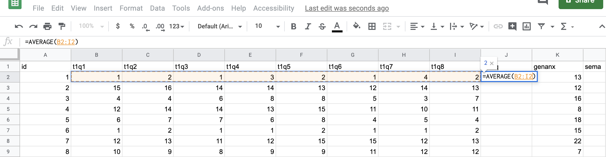


You do not need to enter the equation separately into each cell of this column because spreadsheets will autofill equations for you. To do this, select the cell containing the formula, then select the small square in the bottom right corner of the cell and drag it down to the last row in the dataset. (In some programs you can double-click on the small square and it will autofill to the bottom of the column).   


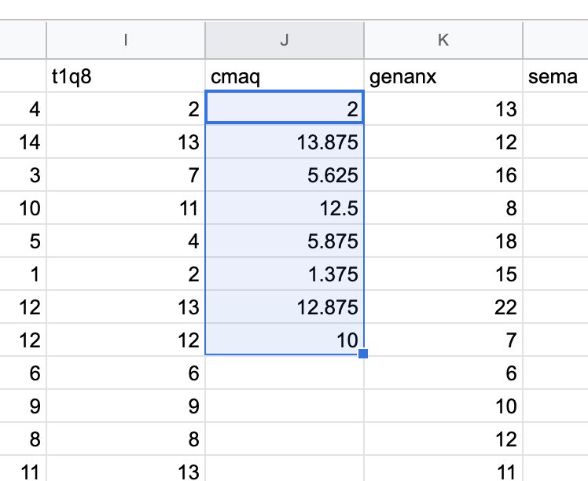

When the cmaq column is complete (i.e. you have calculated the average score for each participant), save the data as a .csv file.   

To do this in google sheets, select in the top bar menu:  

FILE -> DOWNLOAD -> COMMA-SEPERATED VALUES (.CSV)  

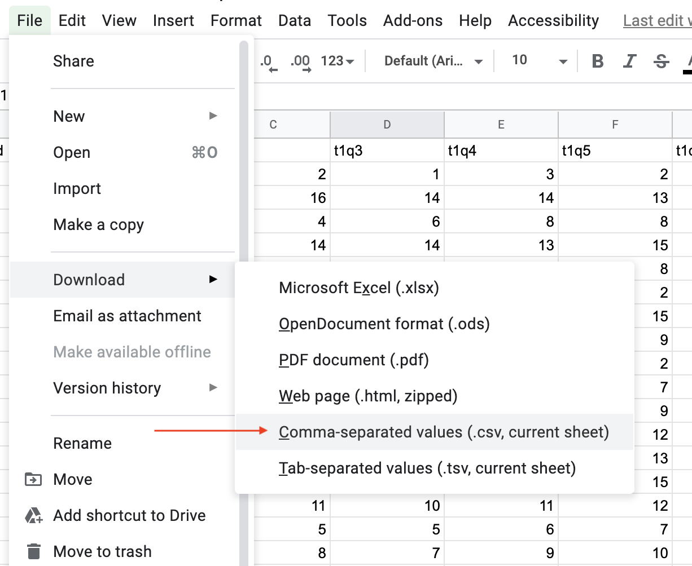
Again, the process is very similar in other spreadsheet programs.   

Next import the data into your RStudio project and assign the dataset to an object called cmaqpilot. To assign the data to an object, you can use the point and click (GUI) method or you could use the following code:    

```{r message=FALSE, warning=FALSE}

library(readr)
cmaqpilot <- read_csv("measurementma.csv")

```

Load the tidyverse and psych packages (if they are not loaded already):   

```{r message=FALSE, warning=FALSE}

library(tidyverse)
library(psych)

```


And then let's first create of histogram of the CMAQ scores:   

```{r}
ggplot(cmaqpilot, aes(x=cmaq)) + 
  geom_histogram(binwidth=1)

```

The figure shows that all scores are within the range of possible scores, suggesting no errors occurred during data entry or when you calculated the average scores. The shape is slightly bi-modal, suggesting students are more likely to feel high or low levels of math anxiety, than to feel moderate amounts of math anxiety.   


### Reliability

The first step in establishing construct validity is to test the reliability of the measure. **Reliability** refers to consistency.   


#### Internal reliability 
For self-report measures, like the CMAQ, you need to measure internal reliability, which measures the extent to which people give consistent responses on every item of a survey. Researchers typically use Cronbach's alpha to test whether a measurement scale has internal reliability. Cronbach's alpha is essentially the average correlation of the correlations between each item of the scale (for a 3 item scale: the average of the correlations between item 1 and 2, item 1 and item 3, and item 2 and 3). This average is weighted by the average variance and the number of items, so it is not quite that simple - but it is the gist.  

Like all correlations, Cronbach's alphas can technically range from -1 to 1. Higher Cronbach's alphas indicate better internal reliability (the correlations between the scale items are higher). Cronbach's alphas of over .70 are considered acceptable in psychology.   

I said technically above because negative Cronbach's alphas are almost unheard of. In the math anxiety example, that would mean that children reported feeling anxious for one item while not feeling anxious for another item. If all of the items are measuring the same thing (math anxiety), people should respond to them in a consistent matter.   

In order to calculate the Cronbach's alpha in R you have to create a new object with only the items of the measurement scale.  

```{r}

cmaq <- cmaqpilot %>% 
  select(t1q1, t1q2, t1q3, t1q4, t1q5, t1q6, t1q7, t1q8)

```
 - This code tells R to select the variables listed in the select function from the cmaqpilot and save it as cmaq.  
 
Then use the `alpha()` function, which is part of the psych package, to compute Cronbachs alpha of all if the variables in the cmaq object.

```{r}

alpha(cmaq)

```

In the output - focus on the raw alpha. In this example the Cronbach's alpha is .98, which is very high - indicating very good internal reliability (Cronbach's alpha with young kids are rarely this high - outing me for making up this data).  

When Cronbach's alphas are less than .70, researchers have to revise and reconsider items. The purpose of the rest of the output is to get a sense of what Cronbach's alpha would be without an item. (Here is a good reference for more information about the rest of the alpha() function output if you are interested: https://rpubs.com/hauselin/reliabilityanalysis)


#### Test-retest reliability 

Test-retest reliability refers to consistency of a measure over time. To test this we will use scatterplots and correlation coefficients.  

Let's first create a scatterplot of the relation between the cmaq and the t2cmaq variable. 

```{r}

ggplot(cmaqpilot, aes(x=cmaq, y=t2cmaq)) +
  geom_point()

```

This scatterplot looks highly positive.  

Let's next calculate a correlation coefficient between the cmaq and the t2cmaq variable. We will use the `corr()` function to calculate the confidence interval, effect size, and NHST (Null Hypothesis Significance Testing). The `corr.test()` function is part of the Psych package and the organization of the code below uses Tidyverse, so you should have both packages loaded. 

Here is the code to compute the correlation coefficient between the cmaq and the t2cmaq variable:  

`cmaqpilot %>%`  
  `  select(cmaq, t2cmaq) %>% `  
 `  corr.test() %>% `  
 `  print(short=FALSE)`  
 
-	Add `method="spearman"` within the `corr.test()` parentheses for ranked data (For example: `corr.test(method = "spearman")`)
-	The `short = FALSE` in the `print()` parentheses prints the confidence intervals
-	Use `?corr.test` for more options


```{r, echo=FALSE, message=FALSE, warning=FALSE}

cmaqpilot %>%
  select(cmaq, t2cmaq) %>% 
  corr.test() %>% 
  print(short=FALSE)

```

The first correlation matrix shows that the correlation between the cmaq and t2cmaq is .98.  

The second matrix shows the NHST estimates the likelihood of getting results as extreme or more extreme given the null is true (i.e., given there is really no association between the variables). If this likelihood is sufficiently small (less than 5%), than we reject the null hypothesis and conclude that the association is more extreme than zero. When the probability value is listed as 0, you should report it as p < .001.  

The last part of the output gives the confidence intervals around the correlation coefficient. The confidence interval provides an interval estimate of a parameter. Here the parameter is the true correlation between the two variables. In the present example, the correlation coefficient (r = 0.98) is a point estimate of the true association between the CMAQ at time 1 and 2. The confidence interval gives us an interval estimate of this association (it is between .96 to .99). Larger confidence intervals indicate more uncertainty about the true size of the association.  

The scatterplot and correlation coefficient suggest that the CMAQ has test-retest reliability - they both show that the children responded to the CMAQ items consistently over time.  

#### Interrater reliability 

Interrater reliability refers to the consistency of coding ratings between different raters. We will have to use a different example to learn how to test interrater reliability because there is no observational measures in the math anxiety example.   

The NICHD Early Child Care Research Network (1999) studied babies interactions with their mothers and child care providers over the first 3 years of life. They measured maternal sensitivity by observing mothers and their children during a semi-structured mother-child dyadic play procedure. The researchers measured maternal sensitivity by rating the amount of stimulation mothers provided, responsiveness to non-distressed,  intrusiveness, and positive regard during the play session.   

Say you were responsible for validating the observational measure of maternal sensitivity before the NICHD Early Child Care Research began collecting their data.   

You recruited 59 mother-child pairs to come to your lab. After you explained the purpose of the study and got consent, you recorded them during the semi-structured play procedure.   

Then you and another researcher each watched the recordings (separately) and rated the mothers on the amount of stimulation mothers provided, their responsiveness when their child was not distressed, their intrusiveness, and their positive regard. You and the other researcher had a common codebook of behaviors to look for and were trained to recognize them.   

The data is in matsen.csv   

Open the data in RStudio.  

```{r message=FALSE, warning=FALSE}

library(readr)
matsen <- read_csv("matsen.csv")

```

The first column is an arbitrary ID number. If you scroll down, you will see there are 59 mothers in total.  

Next is your observational rating of each mother's sensitivity to her child during the semi-structured play session. The third column is the other researchers' observations.  

Let’s test the reliability of the observational measure of maternal sensitivity.  

Let's first create a scatterplot:  

```{r}

library(tidyverse)
ggplot(matsen, aes(x=SEN24, y=SEN24R2)) +
  geom_point()

```  

The scatterplot shows a strong positive relation between the two independent ratings of maternal sensitivity.  

Next quantify the relation by computing a correlation coefficient.  

```{r, message=FALSE, warning=FALSE}

matsen %>%
  select(SEN24, SEN24R2) %>% 
  corr.test() %>% 
  print(short=FALSE)

```

The results show that the correlation between the two raters is .94 with a 95% confidence interval of .90 to .96. This suggest strong agreement between raters.  


### Validity
The next step in establishing the construct validity of the CMAQ is to establish that is has validity. **Validity** refers to accuracy. We will focus on the 3 empirical ways to assess validity here.    


#### Criterion validity

Criterion validity refers to whether a measure is related to relevant behavioral outcomes. 

In the current example, we will test whether the CMAQ is related to scores on the applied problems subscale of the Woodcock-Johnson III (WJ-III).

```{r}
ggplot(cmaqpilot, aes(x=cmaq, y=wjap)) +
  geom_point() 
```

This plot suggests that the CMAQ is strongly (and positively) correlated to scores on the applied problems subscale of the WJ-III, which is evidence for criterion validity of the CMAQ.  

You could add the regression line to the scatterplot by adding `geom_smooth(method='lm')` to your code.   

```{r message=FALSE, warning=FALSE}
ggplot(cmaqpilot, aes(x=cmaq, y=wjap)) +
  geom_point() +
  geom_smooth(method='lm')
```

Some think that it is easier to see that the data points are close to the regression line. It also allows you to see the slope of the line - steeper lines indicate stronger relations.  

Next calculate the correlation coefficient:  

```{r, message=FALSE, warning=FALSE}

cmaqpilot %>%
  select(cmaq, wjap) %>% 
  corr.test() %>% 
  print(short=FALSE)

```

CMAQ scores were positively related to students' applied problems WJ-III scores (r = .84, p < .001, CI.95 = .72 to .91).

The scatterplot and correlation show that the CMAQ is highly related to a behavioral measure of math ability, the applied problems WJ-III scores. [I guess math ability is not the same as math anxiety - despite evidence that they are strongly related. Perhaps a neuro-based variable would have been better here?]

#### Convergent and Discriminant Validity

Convergent and discriminant validity are often considered together. Convergent validity is whether a measure is related to similar measures. Discriminant validity is whether a measure is not related to dissimilar measures.   

In the current example, we will test whether the CMAQ is related to the SEMA, which is another measure of math anxiety. Remember that higher scores on the SEMA indicates high levels of math anxiety. While low scores on the CMAQ indicate high levels of math anxiety. So a negative relation here would indicate convergent validity.  


```{r message=FALSE, warning=FALSE}
ggplot(cmaqpilot, aes(x=cmaq, y=sema)) +
  geom_point() +
  geom_smooth(method='lm')

```

The figure shows that the CMAQ is negatively correlated to the SEMA.  

Next calculate the correlation coefficient:  

```{r, message=FALSE, warning=FALSE}

cmaqpilot %>%
  select(cmaq, sema) %>% 
  corr.test() %>% 
  print(short=FALSE)

```

CMAQ scores were negatively related to students' SEMA scores (r = -.80, p < .001, CI.95 = -.89 to -.65). That is, children reported equal levels of math anxiety on the CMAQ and SEMA.  

In the current example, we will test discriminant validity by testing whether the CMAQ is related to general anxiety. Here a zero relation would indicate convergent validity.   


```{r message=FALSE, warning=FALSE}
ggplot(cmaqpilot, aes(x=cmaq, y=genanx)) +
  geom_point() +
  geom_smooth(method='lm')

```

The figure shows a zero correlation between CMAQ and SEMA.  

Next calculate the correlation coefficient:   

```{r, message=FALSE, warning=FALSE}

cmaqpilot %>%
  select(cmaq, genanx) %>% 
  corr.test() %>% 
  print(short=FALSE)

```

CMAQ scores were not related to students' general anxiety scores (r = -.12, p = . 47, CI.95 = -.41 to .20). Note that the confidence interval here includes zero, which is consistent with NHST because both are saying that zero is a likely correlation between the variables.  

Taken together, the CMAQ seems to have convergent and discriminant validity because it is highly related to another measure of math anxiety and it is not related to general anxiety.   


<!--chapter:end:measurement.Rmd-->

# Basic Data Transformations

**NOTE: please create a new script for this chapter and the interrater relatiablity seciton called week 4**

For this section we will use a dataset from SPSS for Research Methods by Wilson-Doenges, which comes with our Morling text. [Here](https://docs.google.com/document/d/1V1vHljcqtVYXE-2iHcdcR0FNzjdCmJXc6Je5TuWMPuk/edit?usp=sharing) is the survey that Wilson-Doenges distributed to 45 students.  

You can find the data on D2L called `‘wilson.csv’`.  
 
Please download it and take a few minutes to look over the survey (open the link above in the word ‘here’) and study how Wilson-Doenges entered in her data.  

The first column is an arbitrary ID number assigned to each student to ensure anonymity. The next 4 columns correspond with the first four questions of the survey. 

The second part of the survey measures students’ positive opinions about a research methods class. Wilson calls it the positive opinions about research methods scale (PORMS). In the data file, these are item1, item2, item3, item4, and item5.  

The last two questions of the survey ask students to report their motivation to achieve and their GPA (the last two columns).  

First load the readr and tidyverse packages (if they are not loaded already):   

```{r message=FALSE, warning=FALSE}

library(readr)
library(tidyverse)

```

Then assign the data to an object using the following code (or you can use the GUI method):  

```{r message=FALSE, warning=FALSE}

wilson <- read_csv("wilson.csv") 

```


While you were looking at the survey, you may have noticed that items 2 and 4 of the PORMS are negatively worded; While items 1, 3, and 5 are positively worded. This means that strongly agree (i.e. the number 5) indicates that students have a negative opinion of research methods classes for items 1 and 4 and that they have a positive opinion of the class for items 1, 3, and 5.   


We need all of the items to go in the same direction. So, we need to **reverse code** items 2 and 4 so that higher scores reflect more positive opinions. To reverse code, we will use the **mutate()** and **recode()** functions of the dplyr package (that is part of tidyverse), which adds new variables or changes existing ones. 
* mutate() is used to add variables (or columns) to a dataset. 
* recode() is best used inside a mutate (). Recode takes the form of old_value = new_value.

The command to reverse code item 2 is:

```{r}

wilson <- wilson %>%
   mutate(item2r =recode(item2, `1` = 5, `2` = 4, `3` = 3, `4` = 2, `5` = 1))

```


*	`item2r` will be the name of the new variable. 
*	`item2` is the item that is being recoded. 
* Next is the list of the old and new variables 
    + On the left is the old variable and it must be in back ticks (`) when it is a number
    + Note that the back tick is not the same as a comma ( `'` ). The back tick is on the same key as `~` (while the comma is on the same key as `"`)
    + String (AKA text) variables should be in quotes (`"`) instead of back ticks
    + On the right is the new value
*	The `wilson <-` part of the command saves the variable you created with the rest of the code
    + Here we are saving over the original dataset. 
    + Some people prefer to create a new dataset. For example  `wilsonr <-`   would create a new object called wilsonr and the wilson data would not change.
    + Without this part of the code, your new variable will not be saved.   

After you run the code, there should be 13 variables in the wilson dataset (there was 12 orginally).

  
Click on the word ‘wilson’ in the environment panel to view the data.  

  

The reverse coded item 2 variable (item2r) that we just created will be in the last column.  

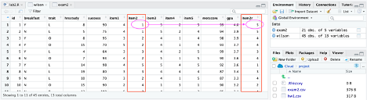  

(You can expand the data view by dragging the center median between the dataview and the environment to the right.)   

You can see that the first student rated the second item as a 1 and it is now a 5 in the reversed coded variable.  

Next create a new item for item 4. Here is the code:  


```{r}

wilson <- wilson %>% 
mutate(item4r =recode(item4, `1` = 5, `2` = 4, `3` = 3, `4` = 2, `5` = 1))

```


You should now have 14 variables in the wilson dataset.  

Next let’s create a summary score for the PORMS measure. We will use the mutate() function to do this using this code:  

```{r}
wilson <- wilson %>% 
mutate(porms = item1 + item2r + item3 + item4r + item5)
```

*	porms is the name of the new column  
*	On the right of the equal sign is how the new variable is defined.  

Your wilson dataset should now have 15 variables.   

(I created a sum score here because that is what Wilson-Doenges did. I think an average score would work here as well.)   


<!--chapter:end:datatran.Rmd-->

# Bivariate correlational research


## Association claim with two quantitative variables 

Are lifestyle choices related to the development of Alzheimer's disease? (Siddarth et al., 2018)[https://journals.plos.org/plosone/article?id=10.1371/journal.pone.0195549] asked a sample of 35 adults over the age of 45 how many hours they typically spend sitting on the week days. They found that the amount of time their participants reported sitting was negatively related to the the total thickness of their participants' medial temporal lobe (MTL). This is important because the MTL is smaller in people who have Alzheimer's disease.   

Siddarth and colleagues (2018) included data in their article, so let's reproduce their findings!  


#### Open data

Download the data from D2L and open it:  

```{r message=FALSE, warning=FALSE}

library(readr)
sitMTL <- read_csv("siddarth.csv")

```


This dataset has many variables. We will be using the Sitting variable which is the hours a day the participants spent sitting. We will also use the TOTAL variable which is the total size of the participants MTL.  

#### Get to know data and test assumptions

First load the tidyverse and psych packages (if they are not loaded already):   

```{r message=FALSE, warning=FALSE}

library(tidyverse)
library(psych)

```

We will be testing the relation between time spent sitting and MTL size using a correlation. More specifically, we will use a Pearson's correlation (which is the same type of correlation that we used in the measurement section. Some treat it as the default correlation).  

All statistical tests have assumptions about the data.  

The assumptions of a Pearson's correlation are:   
1 - The variables are interval or ratio  (hours and size are both interval data)  
2 - Linearity   
3 - Absence of outliers   
4 - Approximately normally distributed  

Let's first consider outliers and the shape of the distributed by creating histograms of the variables:   

```{r message=FALSE, warning=FALSE}

ggplot(sitMTL, aes(x=Sitting)) +
  geom_histogram(binwidth=1)

```
The distibution looks roughly mound shaped and there does not seem to be any outliers.  


```{r message=FALSE, warning=FALSE}

ggplot(sitMTL, aes(x=TOTAL)) +
  geom_histogram(binwidth=.07)

```
Again, the distibution looks roughly mound shaped and there does not seem to be any outliers.  


Next let's consider linearity by creating a scatterplot.  

```{r}
ggplot(sitMTL, aes(x=Sitting, y=TOTAL)) +
  geom_point()

```  

The scatterplot shows a linear (and negative) relation. No evidence for curilinearity (or multivariate outliers).  

#### Compute CI, effect size, and NHST

Next calculate the Pearson correlation. Again, we did this in the measurement section.  

The code first tells R which data file to use (sitMTL), then which variables to use (Sitting and TOTAL) and then to compute a correlation. The print(short=FALSE) tells R to include the confidence intervals.  

```{r message=FALSE, warning=FALSE, results="hide"}

sitMTL %>%
  select(Sitting, TOTAL) %>% 
  corr.test() %>% 
  print(short=FALSE)

```


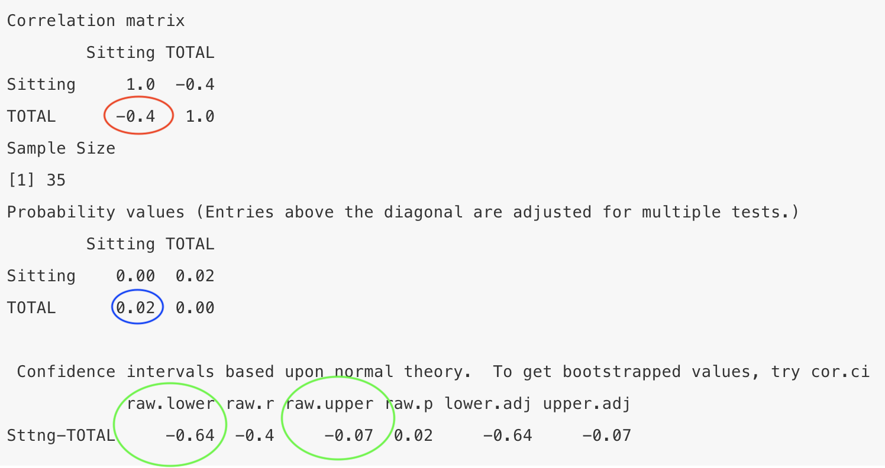
The correlation coefficient is circled in red. The results show that the correlation coefficient is -.40.  

The probability associated with that correlation coefficient is circled in blue. NHST estimates the likelihood of getting results as extreme or more extreme given the null is true (i.e., given there is really no association between the variables). If this likelihood is sufficiently small (less than 5%), than we reject the null hypothesis and conclude that the association is more extreme than zero. The show show that the p value associated with that correlation coefficient is .02, which is under the .05 threshold - so the relation is statistical significant in terms of NHST.  

The confidence intervals are circled in green. The confidence interval provides an interval estimate of a parameter. Here the parameter is the true correlation between the two variables. In the present example, the correlation coefficient (r = -.40) is a point estimate of the true association between sitting and MTL size. The confidence interval gives us an interval estimate of this association (-.07 to -.64). This confidence interval is quite large, indicating uncertainty about the true size of the association between sitting and MTL size.  

Note that the confidence interval here does not include zero, which is consistent with NHST because both are saying that zero is not a likely correlation between the variables.   

#### Write up results

Hours spent sitting were negatively related to the size of the participants' MTL (r = -.40, p < .05, CI.95 = -.07 to -.64).   

You may have noticed that this association is -.37. This is because Siddarth and colleagues used  a partial correlation. We will discuss this in the next chapter.   


## Association claim with one quantitative variable and one categorical variable

Are parents happier than people with no children? Nelson and colleagues (2013) found that people with children reported higher levels of happiness than people who do not have kids.   

Let's say you replicated Nelson et al. (2013). You recruited a convenience sample of 40 adults. You asked them if they were parents and to report their happiness on a 7 point scale.   

#### Open data

```{r include=FALSE}

#generate data....
#parentstatus <- sample(c("parent","nonparent"), size = 40, replace = TRUE)
#happy <- ifelse(parentstatus=="parent", yes = round(rnorm(20, 5, 1.78)), no = round(rnorm(20, 4.5, 1.78)))

#nelsonrep <-tibble(parentstatus, happy)

#save data

#write.csv(nelsonrep,'nelsonrep.csv')

```

Download the data from D2L and open it:   

```{r message=FALSE, warning=FALSE}

library(readr)
nelsonrep <- read_csv("nelsonrep.csv")

```


#### Get to know data and test assumptions

We will use a t-test to calculate the confidence interval, effect size, and NHST of the association between one continuous and one categorical variable.  

There are several types of t-statistics that differ in their assumptions about the normality of the data and the similarity of the group variances. For a two independent group design all t-statistics assume that the groups are independent from each other. In this example, the assumption of independence is met because the participants in each group (parents and non-parents) are not related to each other. 

Then test normality with a Shapiro-Wilk test:  
  
*	first tell R to use the nelsonrep dataset  
* put the categorical variable in the group_by parentheses  
* put the continious varaible in the shapiro.test parentheses  
```{r}

nelsonrep %>%
  group_by(parentstatus) %>%
  summarise(statistic = shapiro.test(happy)$statistic,
            p.value = shapiro.test(happy)$p.value)

```
A significant test of normality (Shapiro-Wilk) indicates that the data is *not* normally distributed. With non-normal data, a Wilcoxon-Mann-Whitney U test should be used, which is a nonparametric alternative to the independent-sample t-test.

In this example, the happiness variable was normally distributed for the nonparent group (the p value is .167 - which is greater than .05), but the happiness scores of the parent group was not normally distributed (the p-value is .017).

Then we will test equality of variances with a Levene’s test. To do this you will need to install the car package first:  

`install.packages("car")`  

Then run the levene test with the following code:  
  
* In the leveneTest parenthesis - list the continuous variable first and put the categorical varaible in the as.factor parenthesis. The dataset name should be added after the `data =`  
```{r message=FALSE, warning=FALSE}
library(car) 
leveneTest(happy ~ as.factor(parentstatus), data = nelsonrep)

```

A significant test of equality of variance (Levene’s) means that group variances are different from each other and in the next step you should run the t-test with the Welch option to account for the unequal variances.  

In this example, the test of equality of variance was nonsignificant.  

Despite the non-normality of the parents' happiness data, we are going to use a Student’s t-test in the next step for the sake of pedagogy. The Student's t-test  assumes that groups are normally distributed and that their variances are equal.  IRL - I would still probably use the student's t-test here because there is evidence that the t-test is more robust to non-normalilty than was once thought. But some would prefer to use the Wilcoxon-Mann-Whitney U test here.  


#### Compute CI, effect size, and NHST

Use the t.test() function to find the CI and NHST with this base R code:  
  
```{r, results="hide"}
t.test(happy ~ as.factor(parentstatus), data = nelsonrep, var.equal = TRUE)

```
  
*	`happy ~ as.factor(parentstatus)` takes the form of continuous variable ~ categorical variable (for association claims)
*	`data = nelsonrep` directs R to the object that contains the data.
*	If the variances are not equal between groups, omit the `var.equal = TRUE` to run a Welch’s t-test 
    +	For example: `t.test(exam2pts ~ cheese, data = exam2)`
*	The default is to calculate 95% confidence intervals (i.e., `conf.level = 0.95`). Because it is the default this code can be omitted, and it will still run. To change the confidence level add `conf.level= 0.XX` (after a comma).
    +	For example, to obtain 90% confidence intervals here use: `t.test(happy ~ as.factor(parentstatus), data = nelsonrep, var.equal = TRUE, conf.level = 0.90)`
*	Use `?t.test` for more options.  

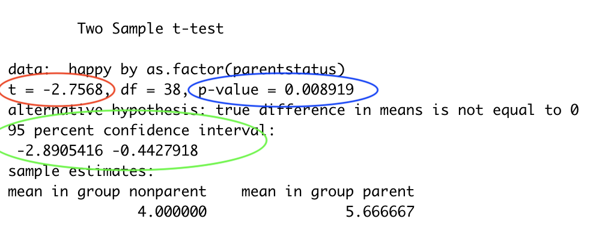  
The confidence intervals are in green. The confidence interval provides an interval estimate of a parameter. Here the parameter is the true difference between groups. In the present example, 1.67 points (the average difference between groups) is a point estimate of the true difference in happiness by parent status. The confidence interval gives us an interval estimate of this difference: between .44 and 2.89 points.  

The t-statistic is circled in red. The p-value (circled blue) estimates the probability of getting results as extreme or more extreme if there was really no difference between the groups. Here this number is less than .05, which rejects the null. This is consistent with the confidence interval, which says that 0 is not a likely difference between the groups.  

The t.test function does not calculate cohen’s d, so we will need to calculate that next. To do this you will need to install the effsize package first:  

`install.packages("effsize")`


Then calculate cohen's D with the following code:  


```{r message=FALSE, warning=FALSE}

library(effsize)
cohen.d(happy ~ as.factor(parentstatus), data = nelsonrep)
```
   
*	The default is Cohen’s d, which uses the pooled population standard deviation in the denominator.  
*	Add `pooled = FALSE` for Glass’ delta, which uses the control condition’s standard deviation (group 2),  
    +	For example: `cohen.d(happy ~ as.factor(parentstatus), data = nelsonrep, pooled = FALSE)`
*	Add `hedges.correction = TRUE` for Hedges’ g, which is preferred with very small sample sizes ( n < 20).
    +	For example: `cohen.d(happy ~ as.factor(parentstatus), data = nelsonrep,  hedges.correction = TRUE)`
*	Add `na.rm=TRUE` if you have missing data.
    + For example, `cohen.d(happy ~ as.factor(parentstatus), data = nelsonrep, na.rm=TRUE)`
*	Use `?cohen.d` for more options.

The results show that the effect size is -.89. The effect size is an indicator of the magnitude of a study’s results. Cohen’s d tells us the standard deviation units between the group means and the amount of overlap between the sets of scores. The larger the Cohen’s d the larger the difference between group means and less overlap between the sets of scores. Cohen’s rule of thumb for interpreting d are: small or weak effect = 0.20; medium or moderate effect = 0.50; and large or strong = 0.80.  

Remember that the direction of Cohen's d (whether it is positive or negative) is due to the way in which the categorical variable was coded (parent happiness minus nonparent happiness or nonparent happiness minus parent happiness).


#### Write up results

Parents' happiness (M = 5.67, SD = 1.71) was higher than nonparents' happiness (M =4.00, SD = 2.1, t(38) = -2.76, p = .0.008, CI95%: -2.89 and -0.44, d = -.89).

*I used this code to find the standard deviation of happiness by parent group:*

```{r message=FALSE, warning=FALSE}
nelsonrep %>% 
  pull(happy) %>% 
  describeBy(nelsonrep$parentstatus)
```


<!--chapter:end:bicorr.Rmd-->

# Multivariate correlational research

<!--chapter:end:multicorr.Rmd-->

# Simple experiment

## Independent group design

### Two groups   

### More than two groups 

## Dependent group design 

### Two groups   

### More than two groups 


<!--chapter:end:simexper.Rmd-->

# Experiments with more than one IV

## Independent-group factorial design 


## Within-group factorial design


## Mixed factorial design


<!--chapter:end:moreexper.Rmd-->

# Final Words


<!--chapter:end:summary.Rmd-->

`r if (knitr:::is_html_output()) '
# References {-}
'`

<!--chapter:end:references.Rmd-->

