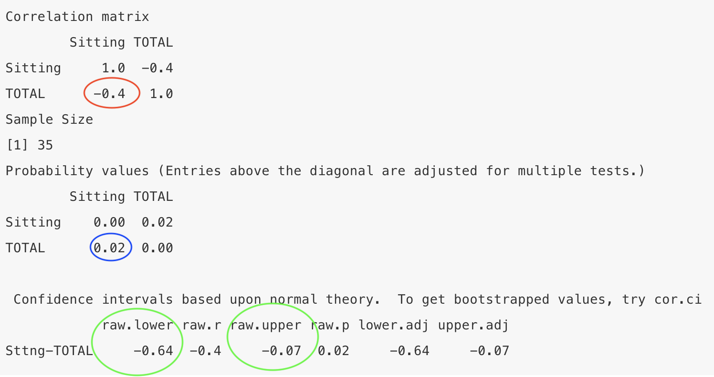
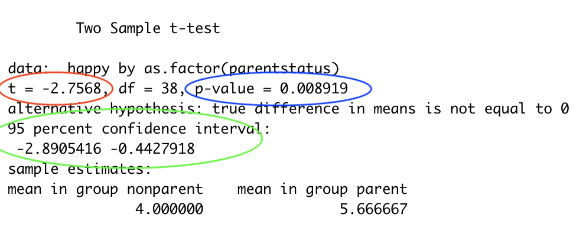

# Bivariate correlational research


## Association claim with two quantitative variables 

Are lifestyle choices related to the development of Alzheimer's disease? [Siddarth et al., 2018](https://journals.plos.org/plosone/article?id=10.1371/journal.pone.0195549) asked a sample of 35 adults over the age of 45 how many hours they typically spend sitting on the week days. They found that the amount of time their participants reported sitting was negatively related to the the total thickness of their participants' medial temporal lobe (MTL). This is important because the MTL is smaller in people who have Alzheimer's disease.   

Siddarth and colleagues (2018) included data in their article, so let's reproduce their findings!  


#### Open data

Download the data from D2L and open it:  

```{r message=FALSE, warning=FALSE}

library(readr)
sitMTL <- read_csv("siddarth.csv")

```


This dataset has many variables. We will be using the Sitting variable which is the hours a day the participants spent sitting. We will also use the TOTAL variable which is the total size of the participants MTL.  

#### Get to know data and test assumptions

First load the tidyverse and psych packages (if they are not loaded already):   

```{r message=FALSE, warning=FALSE}

library(tidyverse)
library(psych)

```

We will be testing the relation between time spent sitting and MTL size using a correlation. More specifically, we will use a Pearson's correlation (which is the same type of correlation that we used in the measurement section. Some treat it as the default correlation).  

All statistical tests have assumptions about the data.  

The assumptions of a Pearson's correlation are:   
1 - The variables are interval or ratio  (hours and size are both interval data)  
2 - Linearity   
3 - Absence of outliers   
4 - Approximately normally distributed  

Let's first consider outliers and the shape of the distributed by creating histograms of the variables:   

```{r message=FALSE, warning=FALSE}

ggplot(sitMTL, aes(x=Sitting)) +
  geom_histogram(binwidth=1)

```
The distibution looks roughly mound shaped and there does not seem to be any outliers.  


```{r message=FALSE, warning=FALSE}

ggplot(sitMTL, aes(x=TOTAL)) +
  geom_histogram(binwidth=.07)

```
Again, the distibution looks roughly mound shaped and there does not seem to be any outliers.  


Next let's consider linearity by creating a scatterplot.  

```{r}
ggplot(sitMTL, aes(x=Sitting, y=TOTAL)) +
  geom_point()

```  

The scatterplot shows a linear (and negative) relation. No evidence for curilinearity (or multivariate outliers).  

#### Compute CI, effect size, and NHST

Next calculate the Pearson correlation. Again, we did this in the measurement section.  

The code first tells R which data file to use (sitMTL), then which variables to use (Sitting and TOTAL) and then to compute a correlation. The print(short=FALSE) tells R to include the confidence intervals.  

```{r message=FALSE, warning=FALSE, results="hide"}

sitMTL %>%
  select(Sitting, TOTAL) %>% 
  corr.test() %>% 
  print(short=FALSE)

```



The correlation coefficient is circled in red. The results show that the correlation coefficient is -.40.  

The probability associated with that correlation coefficient is circled in blue. NHST estimates the likelihood of getting results as extreme or more extreme given the null is true (i.e., given there is really no association between the variables). If this likelihood is sufficiently small (less than 5%), than we reject the null hypothesis and conclude that the association is more extreme than zero. The show show that the p value associated with that correlation coefficient is .02, which is under the .05 threshold - so the relation is statistical significant in terms of NHST.  

The confidence intervals are circled in green. The confidence interval provides an interval estimate of a parameter. Here the parameter is the true correlation between the two variables. In the present example, the correlation coefficient (r = -.40) is a point estimate of the true association between sitting and MTL size. The confidence interval gives us an interval estimate of this association (-.07 to -.64). This confidence interval is quite large, indicating uncertainty about the true size of the association between sitting and MTL size.  

Note that the confidence interval here does not include zero, which is consistent with NHST because both are saying that zero is not a likely correlation between the variables.   

#### Write up results

Hours spent sitting were negatively related to the size of the participants' MTL (r = -.40, p < .05, CI.95 = -.07 to -.64).   

You may have noticed that this association is -.37. This is because Siddarth and colleagues used  a partial correlation. We will discuss this in the next chapter.   


## Association claim with one quantitative variable and one categorical variable

Are parents happier than people with no children? Nelson and colleagues (2013) found that people with children reported higher levels of happiness than people who do not have kids.   

Let's say you replicated Nelson et al. (2013). You recruited a convenience sample of 40 adults. You asked them if they were parents and to report their happiness on a 7 point scale.   

#### Open data

```{r include=FALSE}

#generate data....
#parentstatus <- sample(c("parent","nonparent"), size = 40, replace = TRUE)
#happy <- ifelse(parentstatus=="parent", yes = round(rnorm(20, 5, 1.78)), no = round(rnorm(20, 4.5, 1.78)))

#nelsonrep <-tibble(parentstatus, happy)

#save data

#write.csv(nelsonrep,'nelsonrep.csv')

```

Download the data from D2L and open it:   

```{r message=FALSE, warning=FALSE}

library(readr)
nelsonrep <- read_csv("nelsonrep.csv")

```


#### Get to know data and test assumptions

We will use a t-test to calculate the confidence interval, effect size, and NHST of the association between one continuous and one categorical variable.  

There are several types of t-statistics that differ in their assumptions about the normality of the data and the similarity of the group variances. For a two independent group design all t-statistics assume that the groups are independent from each other. In this example, the assumption of independence is met because the participants in each group (parents and non-parents) are not related to each other. 

Then test normality with a Shapiro-Wilk test:  
  
*	first tell R to use the nelsonrep dataset  
* put the categorical variable in the group_by parentheses  
* put the continious varaible in the shapiro.test parentheses  
```{r}

nelsonrep %>%
  group_by(parentstatus) %>%
  summarise(statistic = shapiro.test(happy)$statistic,
            p.value = shapiro.test(happy)$p.value)

```
A significant test of normality (Shapiro-Wilk) indicates that the data is *not* normally distributed. With non-normal data, a Wilcoxon-Mann-Whitney U test should be used, which is a nonparametric alternative to the independent-sample t-test.

In this example, the happiness variable was normally distributed for the nonparent group (the p value is .167 - which is greater than .05), but the happiness scores of the parent group was not normally distributed (the p-value is .017).

Then we will test equality of variances with a Levene’s test. To do this you will need to install the car package first:  

`install.packages("car")`  

Then run the levene test with the following code:  
  
* In the leveneTest parenthesis - list the continuous variable first and put the categorical varaible in the as.factor parenthesis. The dataset name should be added after the `data =`  
```{r include=FALSE}
library(car) 
leveneTest(happy ~ as.factor(parentstatus), data = nelsonrep)

```

A significant test of equality of variance (Levene’s) means that group variances are different from each other and in the next step you should run the t-test with the Welch option to account for the unequal variances.  

In this example, the test of equality of variance was nonsignificant.  

Despite the non-normality of the parents' happiness data, we are going to use a Student’s t-test in the next step for the sake of pedagogy. The Student's t-test  assumes that groups are normally distributed and that their variances are equal.  IRL - I would still probably use the student's t-test here because there is evidence that the t-test is more robust to non-normalilty than was once thought. But some would prefer to use the Wilcoxon-Mann-Whitney U test here.  


```{r message=FALSE, warning=FALSE}

detach("package:car", unload-TRUE)

```

#### Compute CI, effect size, and NHST

Use the t.test() function to find the CI and NHST with this base R code:  
  
```{r, results="hide"}
t.test(happy ~ as.factor(parentstatus), data = nelsonrep, var.equal = TRUE)

```
  
*	`happy ~ as.factor(parentstatus)` takes the form of continuous variable ~ categorical variable (for association claims)
*	`data = nelsonrep` directs R to the object that contains the data.
*	If the variances are not equal between groups, omit the `var.equal = TRUE` to run a Welch’s t-test 
    +	For example: `t.test(exam2pts ~ cheese, data = exam2)`
*	The default is to calculate 95% confidence intervals (i.e., `conf.level = 0.95`). Because it is the default this code can be omitted, and it will still run. To change the confidence level add `conf.level= 0.XX` (after a comma).
    +	For example, to obtain 90% confidence intervals here use: `t.test(happy ~ as.factor(parentstatus), data = nelsonrep, var.equal = TRUE, conf.level = 0.90)`
*	Use `?t.test` for more options.  

  
The confidence intervals are in green. The confidence interval provides an interval estimate of a parameter. Here the parameter is the true difference between groups. In the present example, 1.67 points (the average difference between groups) is a point estimate of the true difference in happiness by parent status. The confidence interval gives us an interval estimate of this difference: between .44 and 2.89 points.  

The t-statistic is circled in red. The p-value (circled blue) estimates the probability of getting results as extreme or more extreme if there was really no difference between the groups. Here this number is less than .05, which rejects the null. This is consistent with the confidence interval, which says that 0 is not a likely difference between the groups.  

The t.test function does not calculate cohen’s d, so we will need to calculate that next. To do this you will need to install the effsize package first:  

`install.packages("effsize")`


Then calculate cohen's D with the following code:  


```{r message=FALSE, warning=FALSE}

library(effsize)
cohen.d(happy ~ as.factor(parentstatus), data = nelsonrep)
```
   
*	The default is Cohen’s d, which uses the pooled population standard deviation in the denominator.  
*	Add `pooled = FALSE` for Glass’ delta, which uses the control condition’s standard deviation (group 2),  
    +	For example: `cohen.d(happy ~ as.factor(parentstatus), data = nelsonrep, pooled = FALSE)`
*	Add `hedges.correction = TRUE` for Hedges’ g, which is preferred with very small sample sizes ( n < 20).
    +	For example: `cohen.d(happy ~ as.factor(parentstatus), data = nelsonrep,  hedges.correction = TRUE)`
*	Add `na.rm=TRUE` if you have missing data.
    + For example, `cohen.d(happy ~ as.factor(parentstatus), data = nelsonrep, na.rm=TRUE)`
*	Use `?cohen.d` for more options.

The results show that the effect size is -.89. The effect size is an indicator of the magnitude of a study’s results. Cohen’s d tells us the standard deviation units between the group means and the amount of overlap between the sets of scores. The larger the Cohen’s d the larger the difference between group means and less overlap between the sets of scores. Cohen’s rule of thumb for interpreting d are: small or weak effect = 0.20; medium or moderate effect = 0.50; and large or strong = 0.80.  

Remember that the direction of Cohen's d (whether it is positive or negative) is due to the way in which the categorical variable was coded (parent happiness minus nonparent happiness or nonparent happiness minus parent happiness).


#### Write up results

Parents' happiness (M = 5.67, SD = 1.71) was higher than nonparents' happiness (M =4.00, SD = 2.1, t(38) = -2.76, p = .0.008, CI95%: -2.89 and -0.44, d = -.89).

*I used this code to find the standard deviation of happiness by parent group:*

```{r message=FALSE, warning=FALSE}
nelsonrep %>% 
  pull(happy) %>% 
  describeBy(nelsonrep$parentstatus)
```

