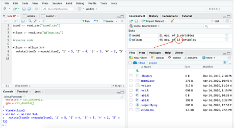
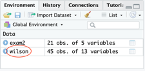
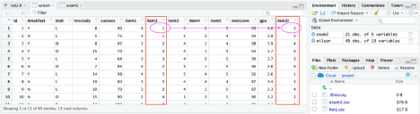

# Basic Data Transformations

**NOTE: please create a new script for this chapter and the interrater relatiablity seciton called week 4**

For this section we will use a dataset from SPSS for Research Methods by Wilson-Doenges, which comes with our Morling text. [Here](https://docs.google.com/document/d/1V1vHljcqtVYXE-2iHcdcR0FNzjdCmJXc6Je5TuWMPuk/edit?usp=sharing) is the survey that Wilson-Doenges distributed to 45 students.  

You can find the data on D2L called `‘wilson.csv’`.  
 
Please download it and take a few minutes to look over the survey (open the link above in the word ‘here’) and study how Wilson-Doenges entered in her data.  

The first column is an arbitrary ID number assigned to each student to ensure anonymity. The next 4 columns correspond with the first four questions of the survey. 

The second part of the survey measures students’ positive opinions about a research methods class. Wilson calls it the positive opinions about research methods scale (PORMS). In the data file, these are item1, item2, item3, item4, and item5.  

The last two questions of the survey ask students to report their motivation to achieve and their GPA (the last two columns).  

First load the readr and tidyverse packages (if they are not loaded already):   

```{r message=FALSE, warning=FALSE}

library(readr)
library(tidyverse)

```

Then assign the data to an object using the following code (or you can use the GUI method):  

```{r message=FALSE, warning=FALSE}

wilson <- read_csv("wilson.csv") 

```


While you were looking at the survey, you may have noticed that items 2 and 4 of the PORMS are negatively worded; While items 1, 3, and 5 are positively worded. This means that strongly agree (i.e. the number 5) indicates that students have a negative opinion of research methods classes for items 1 and 4 and that they have a positive opinion of the class for items 1, 3, and 5.   


We need all of the items to go in the same direction. So, we need to **reverse code** items 2 and 4 so that higher scores reflect more positive opinions. To reverse code, we will use the **mutate()** and **recode()** functions of the dplyr package (that is part of tidyverse), which adds new variables or changes existing ones. 
* mutate() is used to add variables (or columns) to a dataset. 
* recode() is best used inside a mutate (). Recode takes the form of old_value = new_value.

The command to reverse code item 2 is:

```{r}

wilson <- wilson %>%
   mutate(item2r =recode(item2, `1` = 5, `2` = 4, `3` = 3, `4` = 2, `5` = 1))

```


*	`item2r` will be the name of the new variable. 
*	`item2` is the item that is being recoded. 
* Next is the list of the old and new variables 
    + On the left is the old variable and it must be in back ticks (`) when it is a number
    + Note that the back tick is not the same as a comma ( `'` ). The back tick is on the same key as `~` (while the comma is on the same key as `"`)
    + String (AKA text) variables should be in quotes (`"`) instead of back ticks
    + On the right is the new value
*	The `wilson <-` part of the command saves the variable you created with the rest of the code
    + Here we are saving over the original dataset. 
    + Some people prefer to create a new dataset. For example  `wilsonr <-`   would create a new object called wilsonr and the wilson data would not change.
    + Without this part of the code, your new variable will not be saved.   

After you run the code, there should be 13 variables in the wilson dataset (there was 12 orginally).

  
Click on the word ‘wilson’ in the environment panel to view the data.  

  

The reverse coded item 2 variable (item2r) that we just created will be in the last column.  

  

(You can expand the data view by dragging the center median between the dataview and the environment to the right.)   

You can see that the first student rated the second item as a 1 and it is now a 5 in the reversed coded variable.  

Next create a new item for item 4. Here is the code:  


```{r}

wilson <- wilson %>% 
mutate(item4r =recode(item4, `1` = 5, `2` = 4, `3` = 3, `4` = 2, `5` = 1))

```


You should now have 14 variables in the wilson dataset.  

Next let’s create a summary score for the PORMS measure. We will use the mutate() function to do this using this code:  

```{r}
wilson <- wilson %>% 
mutate(porms = item1 + item2r + item3 + item4r + item5)
```

*	porms is the name of the new column  
*	On the right of the equal sign is how the new variable is defined.  

Your wilson dataset should now have 15 variables.   

(I created a sum score here because that is what Wilson-Doenges did. I think an average score would work here as well.)   


