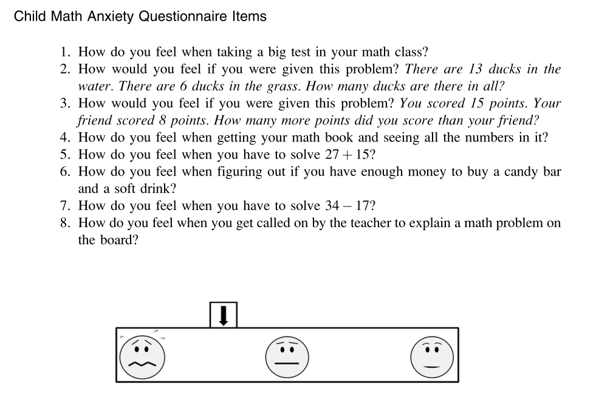
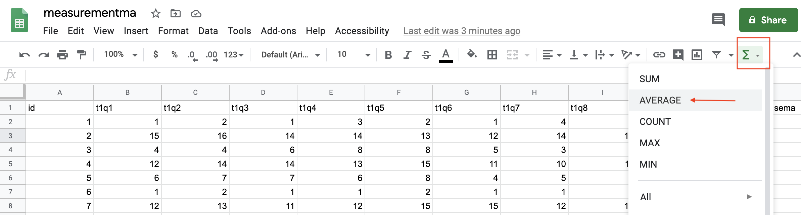
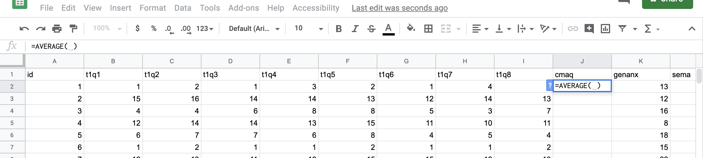
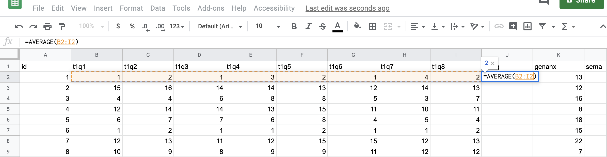
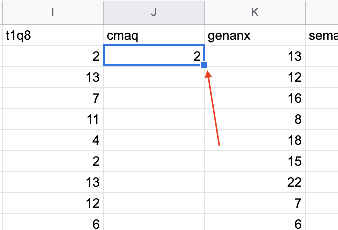
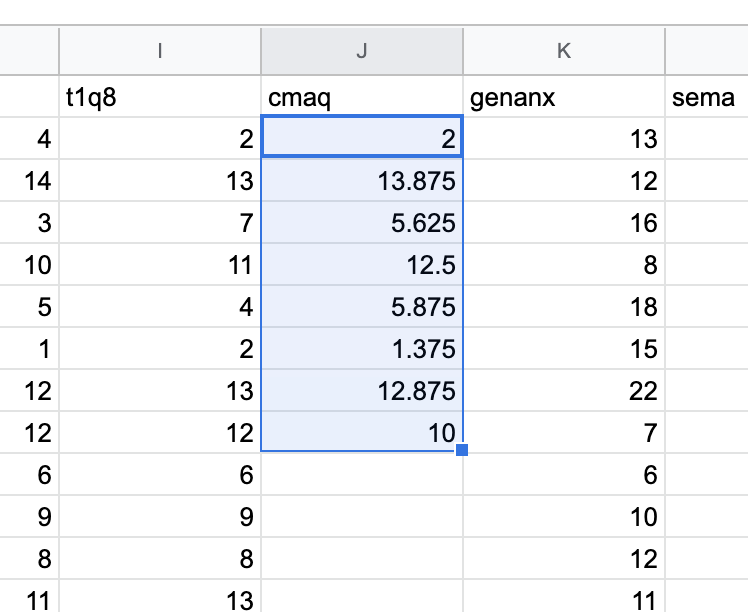
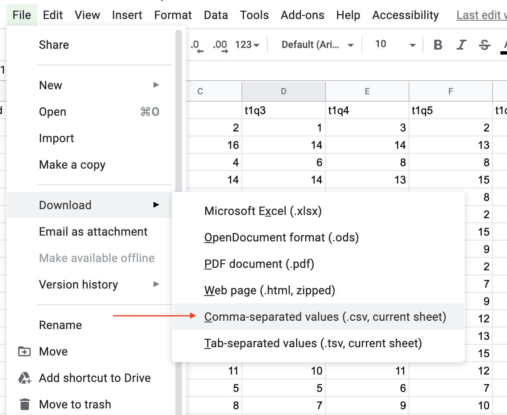

# Measurement
Math anxiety is the feeling of tension or worry in situations that involve math and is a major predictor of math achievement and career choices (Foley et al., 2017; Hembree, 1990).  
[Ramirez and colleagues (2013)](https://drive.google.com/file/d/1VvSqWL7W4mvA5MtDAF94GclVIemC_a9P/view?usp=sharing) developed the Child Math Anxiety Questionnaire (CMAQ) to measure math anxiety of young children. The measure (which can be seen below) consists of 8 questions which children responded to on a sliding scale that ranged from 1 to 16 points (the points were invisible to the children). Ramirez and colleagues (2013) calculated each child’s CMAQ score by computing an average score of the eight items. Low scores on the CMAQ indicates high levels of math anxiety.  




Let's pretend that you completed a pilot study testing the construct validity (if it is a good measure of math anxiety) of the CMAQ before Ramirez and her colleagues studied its relation to working memory and math achievement.  

You gave the CMAQ to a convenience sample of 40 second graders. In addition to measuring the students' math anxiety with the CMAQ, you also measured the students' math ability, general anxiety, and you gave them a different measure of math anxiety.   

[Here is the data.](https://docs.google.com/spreadsheets/d/1UyfrP8h9nsyBCA-KpJAGUFFAzcHO5-RjBfJdeUULPOg/edit?usp=sharing)

The first column is arbitrary ID numbers to identify the participants. The next 8 columns represent your participants responses on the CMAQ items. You will see that column J, titled cmaq, is blank. We will complete this column next in the brief introduction to spreadsheets section.   

The next column (genanx) are a measure of general anxiety which was operationalized as the participants scores on the short form of the State - Trait Anxiety Inventory (STAI) which includes 6 statements - rated on a 1 to 4 point scale. The range is 6 to 24 points, with 6 points signifying no anxiety and 24 points signifying the highest level of anxiety.    

The sema column is participants scores on the Scale for Early Mathematics Anxiety (SEMA), which is another measure of children's math anxiety (Wu et al., 2012). This measure consists of 20 items rated on a 4 point scale (0 - not nervous at all to 3 - very nervous). Responses are summed. Higher scores on the SEMA indicates high levels of math anxiety.  

The wjap column is the participants w-scores on the applied problem subscale of the Woodcock-Johnson III, which consists of math related word problems. The W-scores are Rasch transformed and centered on 500.  

t2cmaq is the participants' CMAQ scores administered 2 weeks later.   


### A brief introduction to spreadsheets (and some brief review of previous material)

Researchers often initially enter data into spreadsheets (excel, google sheet, numbers, etc.). So, I would like to briefly review how to use basic functions in a spread sheet. *We will learn how to create a new variable using R in the data transformation chapter.*   

Either save a copy of the measurementma data to your own google account, or download the data and open it in excel or numbers (or whatever spreadsheet you prefer).

You may have noticed that there is no data in the cmaq column. To complete this column, we need to calculate the average responses of the CMAQ items for each participant. One way to do this is to use the function options within the spreadsheet. (You also could enter the mean formula using the `=` sign, which I am not going to show here. Let me know if you would like me to post a short video showing how to do this.)

My screenshots show how to use the spreadsheet function options in google sheets. However, the process is very similar across all spreadsheet programs - you just might have to look in a different place on your screen. 

First click in the first cell in the cmaq column (cell J2).  

Then click on the sum symbol in the far right of the icon menu, and select the average option.  



Then you should have the average function in cell J2 with nothing in the parenthesis. 



Next you need to tell the spreadsheet which cells you want it to average by listing them in the parenthesis. You can either select the cells you want the spreadsheet to average or you can type the names of the first and last cell separated by a `:` sign (in this example B2 : I2). Then hit enter on your keyboard and the average of the 8 items will appear (2).




You do not need to enter the equation separately into each cell of this column because spreadsheets will autofill equations for you. To do this, select the cell containing the formula, then select the small square in the bottom right corner of the cell and drag it down to the last row in the dataset. (In some programs you can double-click on the small square and it will autofill to the bottom of the column).   





When the cmaq column is complete (i.e. you have calculated the average score for each participant), save the data as a .csv file.   

To do this in google sheets, select in the top bar menu:  

FILE -> DOWNLOAD -> COMMA-SEPERATED VALUES (.CSV)  


Again, the process is very similar in other spreadsheet programs.   

Next import the data into your RStudio project and assign the dataset to an object called cmaqpilot. To assign the data to an object, you can use the point and click (GUI) method or you could use the following code:    

```{r message=FALSE, warning=FALSE}

library(readr)
cmaqpilot <- read_csv("measurementma.csv")

```

Load the tidyverse and psych packages (if they are not loaded already):   

```{r message=FALSE, warning=FALSE}

library(tidyverse)
library(psych)

```


And then let's first create of histogram of the CMAQ scores:   

```{r}
ggplot(cmaqpilot, aes(x=cmaq)) + 
  geom_histogram(binwidth=1)

```

The figure shows that all scores are within the range of possible scores, suggesting no errors occurred during data entry or when you calculated the average scores. The shape is slightly bi-modal, suggesting students are more likely to feel high or low levels of math anxiety, than to feel moderate amounts of math anxiety.   


### Reliability

The first step in establishing construct validity is to test the reliability of the measure. **Reliability** refers to consistency.   


#### Internal reliability 
For self-report measures, like the CMAQ, you need to measure internal reliability, which measures the extent to which people give consistent responses on every item of a survey. Researchers typically use Cronbach's alpha to test whether a measurement scale has internal reliability. Cronbach's alpha is essentially the average correlation of the correlations between each item of the scale (for a 3 item scale: the average of the correlations between item 1 and 2, item 1 and item 3, and item 2 and 3). This average is weighted by the average variance and the number of items, so it is not quite that simple - but it is the gist.  

Like all correlations, Cronbach's alphas can technically range from -1 to 1. Higher Cronbach's alphas indicate better internal reliability (the correlations between the scale items are higher). Cronbach's alphas of over .70 are considered acceptable in psychology.   

I said technically above because negative Cronbach's alphas are almost unheard of. In the math anxiety example, that would mean that children reported feeling anxious for one item while not feeling anxious for another item. If all of the items are measuring the same thing (math anxiety), people should respond to them in a consistent matter.   

In order to calculate the Cronbach's alpha in R you have to create a new object with only the items of the measurement scale.  

```{r}

cmaq <- cmaqpilot %>% 
  select(t1q1, t1q2, t1q3, t1q4, t1q5, t1q6, t1q7, t1q8)

```
 - This code tells R to select the variables listed in the select function from the cmaqpilot and save it as cmaq.  
 
Then use the `alpha()` function, which is part of the psych package, to compute Cronbachs alpha of all if the variables in the cmaq object.

```{r}

alpha(cmaq)

```

In the output - focus on the raw alpha. In this example the Cronbach's alpha is .98, which is very high - indicating very good internal reliability (Cronbach's alpha with young kids are rarely this high - outing me for making up this data).  

When Cronbach's alphas are less than .70, researchers have to revise and reconsider items. The purpose of the rest of the output is to get a sense of what Cronbach's alpha would be without an item. (Here is a good reference for more information about the rest of the alpha() function output if you are interested: https://rpubs.com/hauselin/reliabilityanalysis)


#### Test-retest reliability 

Test-retest reliability refers to consistency of a measure over time. To test this we will use scatterplots and correlation coefficients.  

Let's first create a scatterplot of the relation between the cmaq and the t2cmaq variable. 

```{r}

ggplot(cmaqpilot, aes(x=cmaq, y=t2cmaq)) +
  geom_point()

```

This scatterplot looks highly positive.  

Let's next calculate a correlation coefficient between the cmaq and the t2cmaq variable. We will use the `corr()` function to calculate the confidence interval, effect size, and NHST (Null Hypothesis Significance Testing). The `corr.test()` function is part of the Psych package and the organization of the code below uses Tidyverse, so you should have both packages loaded. 

Here is the code to compute the correlation coefficient between the cmaq and the t2cmaq variable:  

`cmaqpilot %>%`  
  `  select(cmaq, t2cmaq) %>% `  
 `  corr.test() %>% `  
 `  print(short=FALSE)`  
 
-	Add `method="spearman"` within the `corr.test()` parentheses for ranked data (For example: `corr.test(method = "spearman")`)
-	The `short = FALSE` in the `print()` parentheses prints the confidence intervals
-	Use `?corr.test` for more options


```{r, echo=FALSE, message=FALSE, warning=FALSE}

cmaqpilot %>%
  select(cmaq, t2cmaq) %>% 
  corr.test() %>% 
  print(short=FALSE)

```

The first correlation matrix shows that the correlation between the cmaq and t2cmaq is .98.  

The second matrix shows the NHST estimates the likelihood of getting results as extreme or more extreme given the null is true (i.e., given there is really no association between the variables). If this likelihood is sufficiently small (less than 5%), than we reject the null hypothesis and conclude that the association is more extreme than zero. When the probability value is listed as 0, you should report it as p < .001.  

The last part of the output gives the confidence intervals around the correlation coefficient. The confidence interval provides an interval estimate of a parameter. Here the parameter is the true correlation between the two variables. In the present example, the correlation coefficient (r = 0.98) is a point estimate of the true association between the CMAQ at time 1 and 2. The confidence interval gives us an interval estimate of this association (it is between .96 to .99). Larger confidence intervals indicate more uncertainty about the true size of the association.  

The scatterplot and correlation coefficient suggest that the CMAQ has test-retest reliability - they both show that the children responded to the CMAQ items consistently over time.  

#### Interrater reliability 

Interrater reliability refers to the consistency of coding ratings between different raters. We will have to use a different example to learn how to test interrater reliability because there is no observational measures in the math anxiety example.   

The NICHD Early Child Care Research Network (1999) studied babies interactions with their mothers and child care providers over the first 3 years of life. They measured maternal sensitivity by observing mothers and their children during a semi-structured mother-child dyadic play procedure. The researchers measured maternal sensitivity by rating the amount of stimulation mothers provided, responsiveness to non-distressed,  intrusiveness, and positive regard during the play session.   

Say you were responsible for validating the observational measure of maternal sensitivity before the NICHD Early Child Care Research began collecting their data.   

You recruited 59 mother-child pairs to come to your lab. After you explained the purpose of the study and got consent, you recorded them during the semi-structured play procedure.   

Then you and another researcher each watched the recordings (separately) and rated the mothers on the amount of stimulation mothers provided, their responsiveness when their child was not distressed, their intrusiveness, and their positive regard. You and the other researcher had a common codebook of behaviors to look for and were trained to recognize them.   

The data is in matsen.csv   

Open the data in RStudio.  

```{r message=FALSE, warning=FALSE}

library(readr)
matsen <- read_csv("matsen.csv")

```

The first column is an arbitrary ID number. If you scroll down, you will see there are 59 mothers in total.  

Next is your observational rating of each mother's sensitivity to her child during the semi-structured play session. The third column is the other researchers' observations.  

Let’s test the reliability of the observational measure of maternal sensitivity.  

Let's first create a scatterplot:  

```{r}

library(tidyverse)
ggplot(matsen, aes(x=SEN24, y=SEN24R2)) +
  geom_point()

```  

The scatterplot shows a strong positive relation between the two independent ratings of maternal sensitivity.  

Next quantify the relation by computing a correlation coefficient.  

```{r, message=FALSE, warning=FALSE}

matsen %>%
  select(SEN24, SEN24R2) %>% 
  corr.test() %>% 
  print(short=FALSE)

```

The results show that the correlation between the two raters is .94 with a 95% confidence interval of .90 to .96. This suggest strong agreement between raters.  


### Validity
The next step in establishing the construct validity of the CMAQ is to establish that is has validity. **Validity** refers to accuracy. We will focus on the 3 empirical ways to assess validity here.    


#### Criterion validity

Criterion validity refers to whether a measure is related to relevant behavioral outcomes. 

In the current example, we will test whether the CMAQ is related to scores on the applied problems subscale of the Woodcock-Johnson III (WJ-III).

```{r}
ggplot(cmaqpilot, aes(x=cmaq, y=wjap)) +
  geom_point() 
```

This plot suggests that the CMAQ is strongly (and positively) correlated to scores on the applied problems subscale of the WJ-III, which is evidence for criterion validity of the CMAQ.  

You could add the regression line to the scatterplot by adding `geom_smooth(method='lm')` to your code.   

```{r message=FALSE, warning=FALSE}
ggplot(cmaqpilot, aes(x=cmaq, y=wjap)) +
  geom_point() +
  geom_smooth(method='lm')
```

Some think that it is easier to see that the data points are close to the regression line. It also allows you to see the slope of the line - steeper lines indicate stronger relations.  

Next calculate the correlation coefficient:  

```{r, message=FALSE, warning=FALSE}

cmaqpilot %>%
  select(cmaq, wjap) %>% 
  corr.test() %>% 
  print(short=FALSE)

```

CMAQ scores were positively related to students' applied problems WJ-III scores (r = .84, p < .001, CI.95 = .72 to .91).

The scatterplot and correlation show that the CMAQ is highly related to a behavioral measure of math ability, the applied problems WJ-III scores. [I guess math ability is not the same as math anxiety - despite evidence that they are strongly related. Perhaps a neuro-based variable would have been better here?]

#### Convergent and Discriminant Validity

Convergent and discriminant validity are often considered together. Convergent validity is whether a measure is related to similar measures. Discriminant validity is whether a measure is not related to dissimilar measures.   

In the current example, we will test whether the CMAQ is related to the SEMA, which is another measure of math anxiety. Remember that higher scores on the SEMA indicates high levels of math anxiety. While low scores on the CMAQ indicate high levels of math anxiety. So a negative relation here would indicate convergent validity.  


```{r message=FALSE, warning=FALSE}
ggplot(cmaqpilot, aes(x=cmaq, y=sema)) +
  geom_point() +
  geom_smooth(method='lm')

```

The figure shows that the CMAQ is negatively correlated to the SEMA.  

Next calculate the correlation coefficient:  

```{r, message=FALSE, warning=FALSE}

cmaqpilot %>%
  select(cmaq, sema) %>% 
  corr.test() %>% 
  print(short=FALSE)

```

CMAQ scores were negatively related to students' SEMA scores (r = -.80, p < .001, CI.95 = -.89 to -.65). That is, children reported equal levels of math anxiety on the CMAQ and SEMA.  

In the current example, we will test discriminant validity by testing whether the CMAQ is related to general anxiety. Here a zero relation would indicate convergent validity.   


```{r message=FALSE, warning=FALSE}
ggplot(cmaqpilot, aes(x=cmaq, y=genanx)) +
  geom_point() +
  geom_smooth(method='lm')

```

The figure shows a zero correlation between CMAQ and SEMA.  

Next calculate the correlation coefficient:   

```{r, message=FALSE, warning=FALSE}

cmaqpilot %>%
  select(cmaq, genanx) %>% 
  corr.test() %>% 
  print(short=FALSE)

```

CMAQ scores were not related to students' general anxiety scores (r = -.12, p = . 47, CI.95 = -.41 to .20). Note that the confidence interval here includes zero, which is consistent with NHST because both are saying that zero is a likely correlation between the variables.  

Taken together, the CMAQ seems to have convergent and discriminant validity because it is highly related to another measure of math anxiety and it is not related to general anxiety.   


