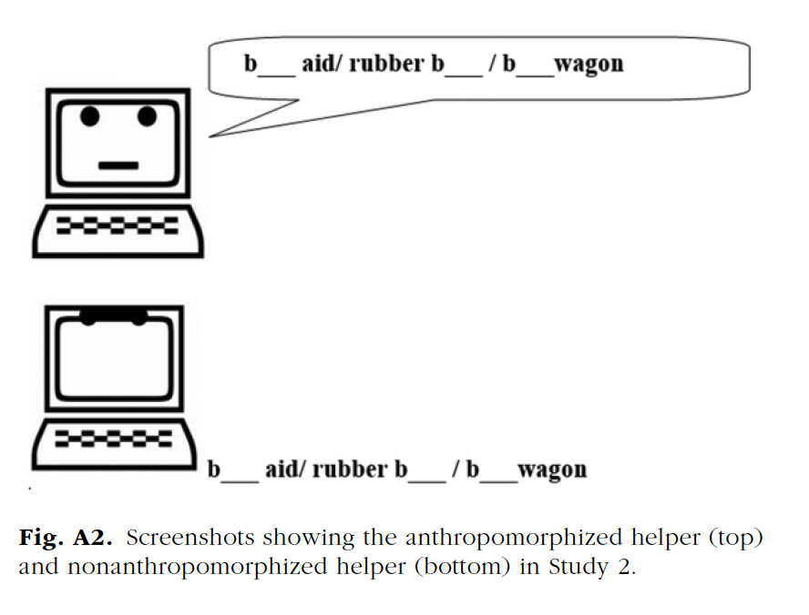

# Experiments with more than one IV

## Research question

Previous research suggests that people tend to seek help from a computer program more often when the computer has human-like features. Kim, Zhang, and Park (2018) tested whether this preference for anthropomorphic helpers depends on individual differences in the way that people think about the malleability of intelligence, or their theory of intelligence (TOI). With an entity TOI, intelligence is thought of as fixed and unchangeable. With an incremental TOI, intelligence is thought of a malleable and changeable. 

## Methods

Kim, Zhang, and Park (2018) recruited 171 undergraduate students. All of the participants were asked to complete an intelligence test and were told they could ask the computer for help on the questions if needed.  

They experimentally manipulated TOI by having participants randomly assigned to the entity condition -which consisted of participants reading an article that supports entity theory (e.g., “neither environmental factors nor intense willpower appear to change this basic stability of intelligence”). Those assigned to the incremental condition read an article supporting an incremental theory (e.g., “intelligence seems to be rather malleable and to develop significantly over time”). A manipulation check found that participants in the entity theory condition expressed a stronger belief in fixed intelligence (M = 4.59, SD = 1.54, 95% CI = [4.25, 4.93]) than did those in the incremental-theory condition (M = 2.67, SD = 1.37, 95% CI = [2.38, 2.96]), t(169) = 8.63, p < .001, d = 1.32, 95% CI for d = [0.99, 1.65]. (**Note that the statistics and research methods terms (like manipulation check) in this last sentence should make sense to you now.**)   

Kim, Zhang, and Park (2018) also randomly assigned their participants to an anthropomorphism condition, where participants received help from a computer-shaped icon with a humanlike face and with the hint placed inside a speech bubble, or to a nonanthropomorphism condition, where participants received help from a computer-shaped icon without a humanlike face, and the hint text did not appear in a speech bubble.  

 

Kim, Zhang, and Park (2018) made their data publicly available. Let's reproduce their analysis testing for difference in the number of times the participants asked for help from the computer program by the two independent variables (TOI and anthropomorphism).  

## Data analysis

Psychologists use a factorial ANOVAs to test for differences between groups in experiments with more than one IV.  

### Open data and load the necessary packages.

Load the data onto your RStudio Cloud project which is in the Study2_Final.csv file on D2L.  

Here is the [codebook](https://osf.io/ys9a5/) 

After you load it into your RStudio cloud project, open the data with the IMPORT DATASET point and click method, or with this code:  

```{r, message = FALSE}
library(readr)

park <- read_csv("Study2_Final.csv")

```

Then load the tidyverse and psych packages with this code:   


```{r message=FALSE, warning=FALSE}

library(tidyverse)
library(psych)

```


### Get to know data

Let's first create new categorical text-based variables from the numeric IV variables in the data (Anthropomorphism and TheoryofIntelligence). This is needed to run the factorial ANOVA below. Let's just do it now because the text also makes the output easier to read compared to remembering what 0 and 1 represent, especially with more than one IV.   

We will use the `mutate()` function of tidyverse to do this. Remember that the old variable should be on the left and it must be in back ticks when it is a number. String (AKA text) variables should be in quotes instead of back ticks.  


```{r}

 park <- park %>%
   mutate(Anthropomorphismf =recode(Anthropomorphism, `0` = "Nonanthropomorphic", `1` = "Anthropomorphism"))
 
park <- park %>%
   mutate(TheoryofIntelligencef =recode(TheoryofIntelligence, `0` = "Incremental", `1` = "Entity"))

```


Then compute measures of central tendency and variability by groups with the `describeBy()` function of the psych package. With two grouping variables, after the DV add `list()` and include both IVs in the parenthesis. 


```{r}

describeBy(park$Total_NumberofHelp,list(park$Anthropomorphismf,park$TheoryofIntelligencef))


```

Finally, let's create of plot of the mean number of times the participants sought help by the two IVs. To this add `group = TheoryofIntelligence, color = TheoryofIntelligence` to the `aes()` function within the ggplot function.   


```{r}

ggplot(park, aes(x = Anthropomorphismf, y = Total_NumberofHelp, group = TheoryofIntelligencef, color = TheoryofIntelligencef)) +
  stat_summary(fun.data = mean_cl_normal) 

```


You could also add a line in order to easily see the interaction by adding ` stat_summary(fun = mean, geom = "line")` to the command.  


```{r}

ggplot(park, aes(x = Anthropomorphismf, y = Total_NumberofHelp, group = TheoryofIntelligencef, color = TheoryofIntelligencef)) +
  stat_summary(fun.data = mean_cl_normal) +
  stat_summary(fun = mean, geom = "line")


```

**Interpretation**

There is a clear interaction between the Anthropomorphism condition and the TOI condition. Participants in the entity condition sought more help in the non-anthropomorphic condition compared to the anthropomorphic condition. The participants in the incremental condition, on the other hand, sought more help in the anthropomorphic condition compared to the non-anthropomorphic condition.

### Stats

We will analyze the data with a 2(anthropomorphism:yes v no) X 2 (TOI: entity v incremental) factorial ANOVA.  

Let's start by creating the model using the `aov()` function.  Remember that this function takes the form of `DV ~ IV`. With multiple IVs it takes the form of `DV ~ IV1 + IV2`. Add `IV1:IV2` to test the interaction (i.e. `DV ~ IV1 + IV2 + IV1:IV2`).  

I called the object parkfano for park factorial ANOVA.  

```{r}
parkfano <- aov(Total_NumberofHelp ~ Anthropomorphismf + TheoryofIntelligencef + Anthropomorphismf:TheoryofIntelligencef, data = park)

```

Then call the model with the `summary()` function to view the results.  

```{r}
summary(parkfano)
```


**Interpretation**  

The first line shows the statistics related to the main effect of Anthropomorphism. The p-value (0.197) associated with the f-value (1.678) is greater than .05, and therefore is not statistically significant.  

The second line shows the statistics for the main effect of TOI. The p-value (0.270) associated with the f-value (1.224) is greater than .05, so this is also not statistically significant.  

The third line shows the statistics for the interaction between Anthropomorphism and TOI. The interaction was statistically significant, as the p-value (0.013) associated with the f-value (6.298) is less than .05.   

Eta-squared is a common measure of effect size for an ANOVA. It can be interpreted in the same way as R-squared in regression (the proportion of the DV that is accounted for by an IV).   

Eta-squared is very easy to calculate. It is the sum of squares for an effect divided by the total sum of squares. So you could pretty quickly do this by hand. For example the eta-squared for the interaction is `107.2/3000.3` is `r 107.2/3000.3` (note that SS total = `28.6+20.8+107.2+2843.7`). This tell us that the interaction accounts for `r 107.2/3000.3` of the variance in the help seeking variable, which is rather small.  

Of course you could also have R do these calculations for you. There are a few packages that commute effect sizes for ANOVA. I like the lsr package, which is maintained by Danielle Navarra.  

First install it:  
`install.packages("lsr")`  

Then load it:  
```{r message=FALSE, warning=FALSE}

library(lsr)

```


This package has a `etaSquared()` function. Put the name of the object containing the factorial ANOVA in the parenthesis.  

```{r message=FALSE, warning=FALSE}

etaSquared(parkfano)

```

The numbers below the et.sq are the eta-squares for each main effect and the interaction. The next column is the partial eta-squares, which is the ratio of variance associated with an effect ignoring the other effects in the factorial ANOVA.   


**Interpretation**

The eta-squared (0.035740724) and the partial eta-squared (0.036339358) tells us that the interaction between Anthropomorphism and TOI accounts for about 3.5% of the total variance in help seeking behaviors.   

Next we need to run post-hoc analysis to determine which groups involved in the interaction are different from each other. Let's first look at the group means. You could scroll up to the descriptives we ran above.   

Or you could use the `model.tables()` function, which is part of base R.  Put the model name in the parenthesis followed by `type="means"`. `model.tables()` is nice to use because it includes the DV's grand mean, the main effect means, and the interaction means.   


```{r}

model.tables(parkfano, type="means")

```

So the grand mean (9.549708) is the mean number of times of all of the participants in the study sought help from the computer.   

Next are the means for the number of help seeking for the Anthropomorphism main effect. The mean of the  anthropomorphism group (9.157) is not different from the nonanthropomorphism (9.976). Rep mean number of participants. 89 participants were in the anthropomorphism condition and 82 were in the nonanthropomorphic condition.   

Next are the means for the TOI main effect. The mean of the Entity group (9.908) is not different from the Incremental group (9.212).   

The last table is the cell means for the interaction. These are the means we need to test to see where the difference between groups are.  

One way to probe the interaction is to use the Tukey HSD host-hoc test function - as we did with the one-way ANOVA. Put the object with the ANOVA results in the parenthesis of the `TukeyHSD()`function.  

```{r}

TukeyHSD(parkfano)

```

The results start with testing the main effects (we no there will be no difference because the main effects in the factorial ANOVA were not statistically significant).   

Then are the cell mean comparisons (below `$`Anthropomorphismf:TheoryofIntelligencef``).  

The only statistically significant difference is between the mean of the Nonanthropomorphic and Entity and the Anthropomorphism and Entity cells (the first comparison). The point estimate of this difference is 2.39302326. An interval estimate is 0.04064076 to 4.74540575 - showing a fair amount of uncertainty.   


Another option to probe the interaction is is to run a t-test separately for each level of one of the IVs. We will use the `filter()` function to select the levels. This function allows you to pick observations or rows by their values. The operations you can use to select a subset of values are: >, >=, <, <=, != (not equal), and == (equal). In this example let's first select the participants that were in the entity condition first. To do this we should put `TheoryofIntelligence == 1` in the parenthesis. Let's also save this as a new object called `parkent` for park-entity.  


```{r}

parkent <- park %>% 
  filter(TheoryofIntelligence == 1)

```

Then using this new dataset, use a independent sample t-test and cohen's d to test for differences in help seeking by Anthropomorphism condition.   

```{r}
t.test(Total_NumberofHelp ~ Anthropomorphismf, data = parkent, var.equal = TRUE)

library(effsize)
cohen.d(Total_NumberofHelp ~ Anthropomorphismf, data = parkent)

```

The results show that the 95% CI is -4.3549407 to -0.4311059, which means that the true difference in the number of times participants sought help based on Anthropomorphism condition use is likely to be between about a half to about four times.   

The results also report that t = -2.4269, df = 81, p-value = 0.01745 - so the difference is statistically significant.   

The Cohen's d is -0.5331208, which is a medium effect. The 95% CI is -0.08835596 to -0.97788567 - indicating that the true size of the effect is close to zero to around 1.   

Next do the same for the participants in the incremental condition. First create an object with just the incremental participants. 

```{r}

parkinc <- park %>% 
  filter(TheoryofIntelligence == 0)

```


Then using this new dataset, use a independent sample t-test and cohen's d to test for differences in help seeking by Anthropomorphism condition.   


```{r}
t.test(Total_NumberofHelp ~ Anthropomorphismf, data = parkinc, var.equal = TRUE)

cohen.d(Total_NumberofHelp ~ Anthropomorphismf, data = parkinc)


```

The results show that the 95% CI is -0.8141959 to 2.3882409, which means that zero is a potential true difference in the number of times participants sought help based on Anthropomorphism condition.

The results also report that t = 0.9771, df = 86, p-value = 0.3313 - so the difference is not statistically significant.   

The Cohen's d is 0.2096764, which is a small effect. The 95% CI is -0.2180713 to 0.6374242  - again indicating that the true size of the effect is potentially zero. 


### APA-style write up

A 2 (TOI: entity vs. incremental) × 2 (anthropomorphism:yes vs. no) factorial analysis of variance (ANOVA) revealed nonsignificant main effects, ps >.20, but a significant interaction, F(1, 167) = 6.30, p = .013, Partial eta-squared = .04. Tukey HSD post-hoc analysis revealed that the participants in the entity conditions asked for help more often in the nonanthropomorphic condition (M = 11.09, SD = 3.83) than the anthropomorphic condition (M = 8.7, SD = 5.1), 95% CI of difference = 0.04 to 4.75.   


### Bonus / optional material: apaTables

The apaTables package will create an APA style ANOVA table. Like with the multiple regression table, you will need to first rerun the Factorial ANOVA with the `lm()` function.  

Then use the `apa.aov.table()` function. Put the name of the lm model in the parenthesis, followed by `filename = "parkfactANOVA.doc"`, and then `table.number = 7`.  Note that you can change the file name to whatever you want - just include the .doc.   


```{r}
library(apaTables)

parkfanoAPA <- lm(Total_NumberofHelp ~ Anthropomorphismf + TheoryofIntelligencef + Anthropomorphismf:TheoryofIntelligencef, data = park)

apa.aov.table(parkfanoAPA, filename = "parkfactANOVA.doc", table.number = 7)

```

Use the table that is saved in the parkfactANOVA.doc file for presentation purposes, as it has all aspects of APA-styled formatting. Also, note that the ANOVA tables include the eta-squared and partial eta-squared (!).   


This package will also create a table of means and standard deviations. To do this use the `apa.2way.table()` function. In the parenthesis list the names of the IVs after `IV1 = ` and `IV 2 =`. Then list the name of the DV variable after `DV = `. This is followed by the data object after `data = `. Then include: `filename = "parkmeans.doc", show.marginal.means = TRUE, table.number = 8)`.  Again - you can change the file name to whatever you want (but don't forget the .doc).     

```{r}
apa.2way.table(iv1 = Anthropomorphismf,iv2 = TheoryofIntelligencef, dv = Total_NumberofHelp, 
               data = park, 
               filename = "parkmeans.doc", 
               show.marginal.means = TRUE,
               table.number = 8)

```


