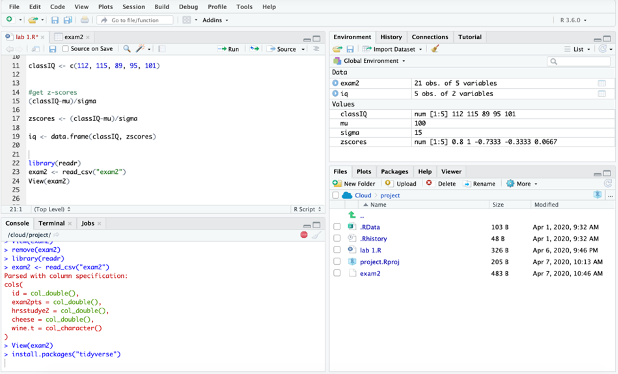
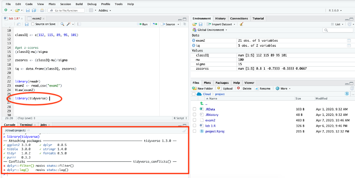

# Packages

**NOTE:** Please open a new script and call it lab 2 (or week 2) for the replication of this chapter and the picturing data chapter assignment.  

**Base R** refers to the functions that automatically come with R. But many people build on top of Base R to make R better. The way they do this is through **packages**, which contain new R functions. There are thousands of packages available that can do fancy things like quickly compute descriptive statistics and create APA style tables (and much much more).   

The first time you use a package, you need to install it. Once a package is installed, you will need to tell R that you want to use it by loading it. You will need to load any packages you want to use each time you open the R program. (I am not exactly sure how this works in the RStudio cloud because it does not seem to shut down when you close out of the RStudio cloud website. See the Restarting R section below for a work around.)   

That is, you only have to install a package once. You will have to load a package every time you want to use it.   

## Installing packages

The first time you use a package, you need to install it. We actually did this once already while importing data! This time let's learn more about the process.  

In RStudio, packages can be installed through point and click (GUI) or with code.  

### Installing packages using point and click (GUI)

Let’s first install a package called **Tidyverse**. Tidyverse was created by Hadley Wickham and his team with the aim of making various aspects of data analysis in R easier. It is actually collection of packages that include a lot of functions (e.g., subsetting, transforming, visualizing) that many people think of as essential for data analysis. (See the tidyverse website for additional information: https://www.tidyverse.org).    

To install a package with GUI go to the top bar menu:  

TOOLS -> INSTALL PACKAGES  

In the install packages window, type the name of the package you would like to install. For example, type `tidyverse` in the packages box.   

Then click INSTALL.  

Again, installing a package can be a little slow on the RStudio cloud. Please be patient (maybe this is a good time to stretch your legs, refill your beverage, let the dog out, etc.)

Your screen should look like this when it is starting to install:   

It should look like this when it is in the process of installing:  

And then this when the installation is complete:   

Do not proceed until the console says the package has been installed.  

### Installing packages using code   

You can also install a package using this code:  
`install.packages()`  

To install tidyverse, for example, you would use this code:  
`install.packages("tidyverse")`  
-	Note that the word tidyverse is in quotes   

But do not run this code – as you have already installed it with GUI.   

Instead, let's install a package called psych using the `install.packages` command. The **psych package** is a package for personality, psychometric, and psychological research. It has been developed at Northwestern University (maintained by William Revelle) to include useful functions for personality and psychological research.   

To install this package, use following command:   
`install.packages("psych")`

Your screen should look like this when the package is completely installed:  

Remember that installing packages is the first step to using them and they only have to be installed once.  

Next let’s learn how to load packages, so that you can use thier functions.   

## Loading Packages   

Installing a package is only the first step.  

**In order to use a package, it must be loaded first.**   

Packages can only be loaded with code. Packages need to be loaded every time you open the RStudio program. Most people's R scripts begin with the code that load packages.  

When you have the Rstudio program installed on your computer this is straight forward (either the program is open or closed). This is less clear with Rstudio cloud because it does not seem to always shut down when you close the web browser site. (Please see the section on restarting Rstudio in the misc section below for a work around.)    

The command to load a package is:   
`library()`    

For example, load the tidyverse package with this:  
`library(tidyverse)`   

After you run this code, your screen should look like this:  

The console shows that the Tidyverse package has been loaded (don’t worry about the conflicts for now).   

Next let's load the psych package using this command:  
`library(psych)`

Again, don’t worry about the warning about masked functions for now.   

## Misc 

You can get additional information using the `help()` function and `?` help operator in R. They both provide access to documentation pages for all functions and packages.   

For example, use the following code to get more information about Tidyverse:  
`?tidyverse`

Or this command to get more information about Psych:  

`help(psych)`

### Restarting R

Because it is unclear whether Rstudio completely turns off when you close the website, you could restart the R session to simulate the act of closing and reopening the Rstudio program (like you could if it were installed on your computer).   

To do this, in the drop down menu go to:  

SESSION -> RESTART R  

When you restart the R session, everything in the script, environment, console, and files will remain.  

All packages that were loaded will be cleared, so you will have to reload them if you want to use them.  

If something is not working like it is suppose to (and you have checked for type-os), try restarting the R session. It could be that the functions of one package conflict or mask the functions of another package. 

