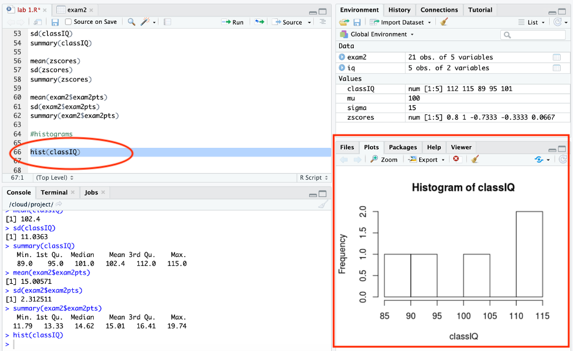
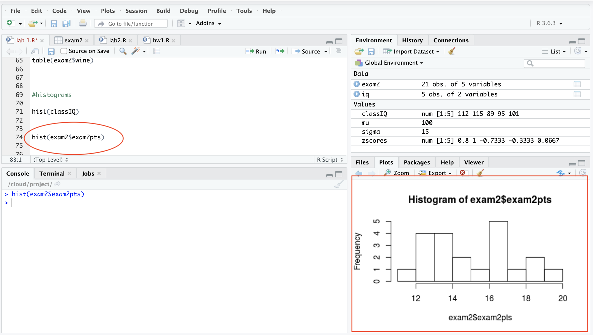
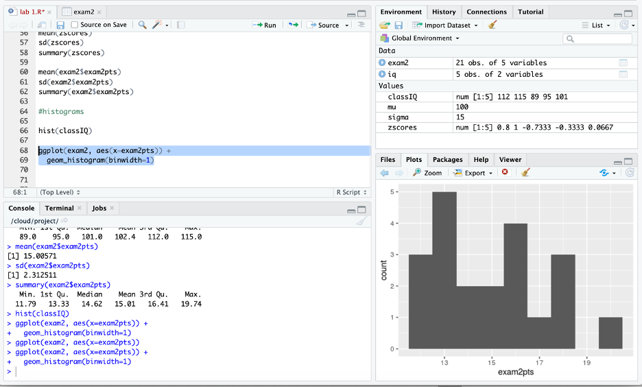
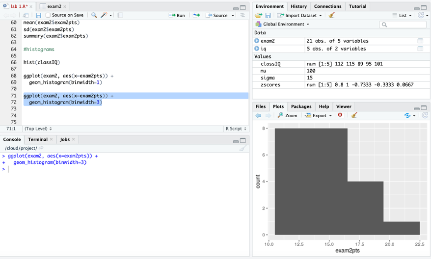
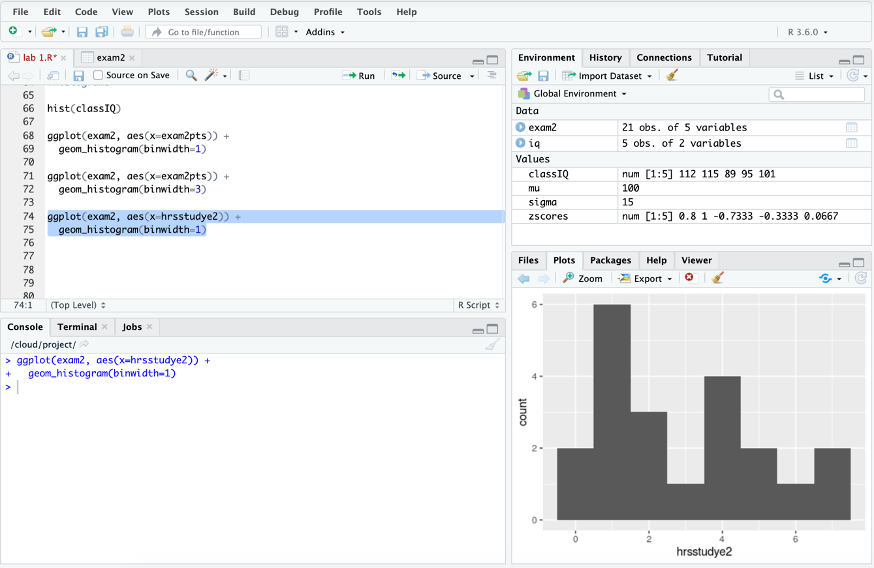
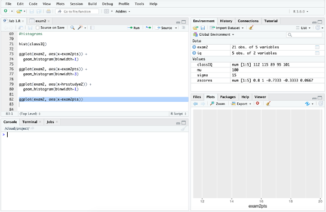

# Picturing Data

“The simple graph has brought more information to the data analyst’s mind than any other device.” — John Tukey  

This chapter focuses on how to make graphs and figures in R.  Data visualization is useful for descriptive statistics, data analysis, and communicating results.  


## Histograms

Here you will learn how to make a histogram. Histograms plot the frequency of each score in a set of data. Thus, they are essentially a graphic of a frequency distribution. They are useful for checking the shape of a distribution (many statistical tests assume data is approximately normally distributed), checking for coding errors, and checking for outliers.   

### Histograms with base R

Let’s first make histogram with base R by using the hist() function.   

A **function** in R is any kind of operation. For example, the `hist()` function will create a histogram. An **argument** is what a function acts on.   

For example, `hist(classIQ)` will return the histogram of the IQ scores in the classIQ vector. This code applies the function hist to the variable classIQ.   

After you run this command, your screen should look similar to this:   


I circled and boxed what should match here. (Please excuse a few differences between this screenshot and your screen, like the name of the script, the code in the script before the histogram, and the results in the console. I had presented the material in a different order the last time I taught it.)    

In order to use a base R function with a variable within a data frame you have to tell R to first look in the data frame in order to find the variable. You do this with the dollar sign (`$`). Place the `$` between the name of the data frame and the name of the variable.   

For example, to use the `hist()` function to create a histogram of the exam 2 points variable in the exam 2 dataset, use this code:   

`hist(exam2$exam2pts)`  
- exam2$exam2pts is telling R to first go to the exam2 dataset and then use the exam2pts variable  

Here is a picture:   


The data looks some what normally distributed, with a slight positive shew.  


### Histograms with tidyverse

The base R option is quick and easy. But it is not customizable. Because of this – many people prefer to use **ggplot** (of the Tidyverse package - so tidyverse needs to be loaded).    

Ggplot is typically taught with the analogy of a globe that is built one layer at a time. You start with a world of only ocean (no land). Then you progressively add “layers” of land, colors, terrain, legends, etc. This system is based on the grammar of graphics: statistical graphics map **data** onto perceivable **aesthetic attributes** (e.g., position, color, shape, size, line type) of **geometric objects** (e.g., points, bars, lines). Code can also be added to ggplots to make graphs in APA style.    

With ggplot, you build plots step-by-step, layer-by-layer using the following steps:    
1. Start with `ggplot()`   
2. Supply a dataset and aesthetic mapping, `aes()`   
3. Add on ...   
  + **Layers**, like `geom_point()` or `geom_histogram()`   
  + **Scales**, like `scale_colour_brewer()`   
  + **Faceting Specifications**, like `facet_wrap()`   
  + **Coordinate Systems**, like `coord_flip()`   


The code for a histogram of the exam 2 points is:  
`ggplot(exam2, aes(x=exam2pts)) +`   
    `geom_histogram(binwidth=1)`   

-	The first line starts with ggplot and then supplies a dataset and aesthetic mapping, `aes()`   
    - Because you supply the dataset this way - you do not need to use `$` to tell R where the variable is  
-	The second line adds the layer of a histogram   

After you run this code your screen should look like this:    



Note that the histogram here is more detailed than the one you produced with base R. This is because base R used 5-points bins, while ggplot used 1-point bins (because you told R to). Here it is easier to see that the data is slightly skewed right.   

In ggplot, it is easy to change the amount of points per bin by changing the number after the binwidth. For example, here I change the number to 3:    


Some say that 10 bins in a histogram is a good rule of thumb (There are more precise equations for determining the “right” number of bins as well).   

Let’s look at a histogram of the number of hours studied for exam 2 next.   

Here is the code:    

`ggplot(exam2, aes(x=hrsstudye2)) +`    
  `geom_histogram(binwidth=1)`    


After you run this code, your screen should look like this:   


The histogram show that data approximates the normal distribution and is roughly mound shape.  

You do not need to run this – but I just want to show you that if I run only the first line of the histogram code, the figure would look like this:  



...so this is the world as only ocean – without land. The second line of the ggplot code (i.e. `geom_histogram(binwidth=1`)) adds the “land”.  


*Please note that I am going to start providing less screen shots of the whole Rstudio window from this point forward. When I include R code know that I mean that the code should be typed into a script.*   

## Scatterplots

```{r, include = FALSE}

library(tidyverse)
library(psych)
library(readr)

exam2 <- read_csv("exam2.csv")


```

A **Scatterplot** is a graph where one variable is plotted on the y-axis and the other is plotted on the x-axis. Each dot represents one participant, measured on two variables.  

We are going to focus on using ggplots to create scatterplots because it is the more powerful data visualization tool in R.  

### Two continuous variables 

Using the exam 2 dataset, let’s say we hypothesized that there is a positive association between exam 2 scores and the number of hours studied for the exam. One of the first steps of exploring this association is to create a scatterplot.  

Here is the code and resulting graph:   

```{r}
ggplot(exam2, aes(x=exam2pts, y=hrsstudye2)) +
  geom_point()

```  
  
The data points are trending upward, suggesting a positive relation between exam 2 scores and the number of hours. The students who studied longer for the exam received higher grades; While those students who studied for less time received lower grades.  


### One continuous and one categorical variable 

Let's say you were interested in the relation between cheese eating and exam 2 scores. You hypothesized that exam scores will be lowers for students who ate cheese the night before the exam because cheese gives nightmares. 

Traditionally psychology likes to visualize the relation between a continuous and categorical variable using a bar graph. However, bar graphs can be misleading about the true nature of the data. Because of this, I prefer to continue to use a scatterplot to look at the association between a continuous and categorical variable - with some alterations to show the mean and variability (which is important to show with group data).  

In ggplots you can alter the scatterplot to include the mean and variability, in addition to the actual data points, by including the `stat_summary()` function in the ggplot code.  The `stat_summary()` function adds statistics to a ggplot.  

To use the `stat_summary()` function you need to install the Hmisc package. It does not need to be loaded. *This is a rare exception on how packages in R normally work - The package does not need to be loaded in order for R to use it.*


Here is the code to install Hmisc:  

`install.packages("Hmisc")`   
- remember to be patient and wait until the package is completely installed.  


Then create the scatterplot with the following ggplot code:  

`ggplot(exam2, aes(x = cheese, y = exam2pts)) +`  
  `geom_point() +`  
  `stat_summary(fun.data = mean_cl_normal)`  

-	x is the categorical variable  
-	y is the continuous variable  
-	`geom_point()` includes the data points  
-	The `fun.data = mean_cl_normal` within the `stat_summary()` function adds the mean and the confidence interval around the mean.  

The graph should look like this:  


```{r echo = FALSE}

ggplot(exam2, aes(x = cheese, y = exam2pts)) +
  geom_point() +
  stat_summary(fun.data = mean_cl_normal)

```

The means are represented by the large dots. The lines represent the 95% confidence intervals, which shows the certainty around the mean and is based on the sample mean, standard deviation, and n.   

The small dots are the data points representing the participants cheese eating and exam grades.    

Here you can see that the mean exam 2 scores are pretty similar for students who did and did not eat cheese the night before the exam. The spread of the scores is also similar. (Remember from the introduction chapter 1 = no and 2 = yes).  

I like to make a few alterations to the previous code for aesthetics...   

`ggplot(exam2, aes(x = as.factor(cheese), y = exam2pts)) +`  
  `geom_point(color = "purple") +`  
  `stat_summary(fun.data = mean_cl_normal)`  

- The `color = "purple"` in the `geom_point()` function changes the color of the data points making the graph easier to read   
- The `as.factor(cheese)` tells R to treat the cheese variable as a factor, which makes the x-axis more visually appealing   


```{r echo = FALSE}

ggplot(exam2, aes(x = as.factor(cheese), y = exam2pts)) +
  geom_point(color = "purple") +
  stat_summary(fun.data = mean_cl_normal)


```
  

## Additional resources 


https://rstudio.cloud/learn/primers/1.1 


