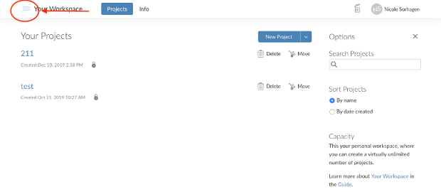
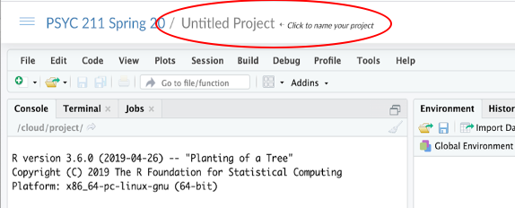

# Set up project on Rstudio Cloud 

First expand the R studio cloud options by clicking on the 3 lines in the top left corner. 

Then select PSYC 211 for the current semester. If you cannot see this option – then you have not been added to our shared workspace. See the Introduction to R – overview (start here) html site on this week’s D2L site for instructions on how to get into our shared workspace.

Once you are in the shared PSYC 211 workspace, open a new project and title it with your last name by clicking on the box that says ‘Untitled Project’ and typing your last name. 

I will be able to see everyone’s project. But you will only be able to see your project and my project. 

