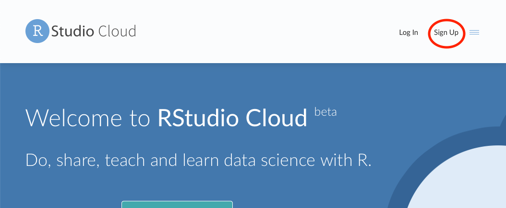

# Set up project on Rstudio Cloud 

We will use Rstudio cloud on this website: https://rstudio.cloud. 

You must first make an Rstudio account by clicking the sign up button in the top right corner. (this is free)  

Then join our shared RStudio cloud workspace with the link that I sent you in the email titled 'Rstudio cloud shared workspace'.   

**You MUST join our shared workspace.** I will be checking your work through this shared RStudio cloud workspace. Within this shared workspace, I will be able to see everyone’s project, but you will only be able to see your project and my project.  

Once you are in your Rstudio Cloud account...   

Expand the R studio cloud options by clicking on the 3 lines in the top left corner. 

Then select our course (which will be titled the name of course and the semester). If you cannot see this option – then you have not been added to our shared workspace.  

Once you are in the shared the classes workspace, open a new project. 

Call this project your last name by clicking on the box that says ‘Untitled Project’ and typing your last name.   

